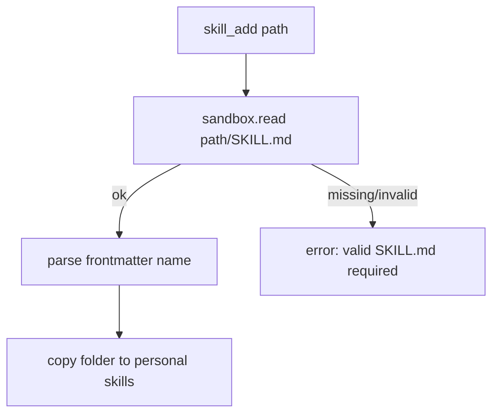

# Skill Filename Canonicalization: `SKILL.md`

## Summary
- `SKILL.md` is now the canonical skill filename constant used by runtime tools.
- `skill_add` now validates source folders by reading `SKILL.md` via sandbox paths.
- Recursive skill discovery/resolve keeps case-insensitive matching for portability.

## Why
- The skill convention in this repository and shared skills uses uppercase `SKILL.md`.
- Using lowercase as canonical caused `skill_add` failures for valid uppercase skills.

## Flow

