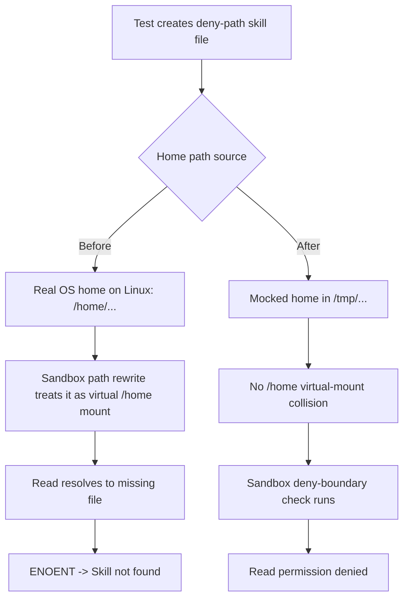

# Skill Tool Deny-Path CI Fix

## Context

GitHub Actions run `22435728955` failed in `sources/engine/modules/tools/skillToolBuild.spec.ts` for the test:

- `denies direct-path skill load when file is outside approved read scope`

The test created a denied path under `os.homedir()`. On Linux CI, that became `/home/...`, which collided with sandbox virtual path mapping and caused a file-not-found path rewrite instead of a permission-denied path.

## Change

- The test now mocks `os.homedir()` to a temp directory under `os.tmpdir()`.
- The denied test skill is created under that mocked home directory.
- Cleanup now restores the mock and removes the mocked home directory tree.

## Why It Works

