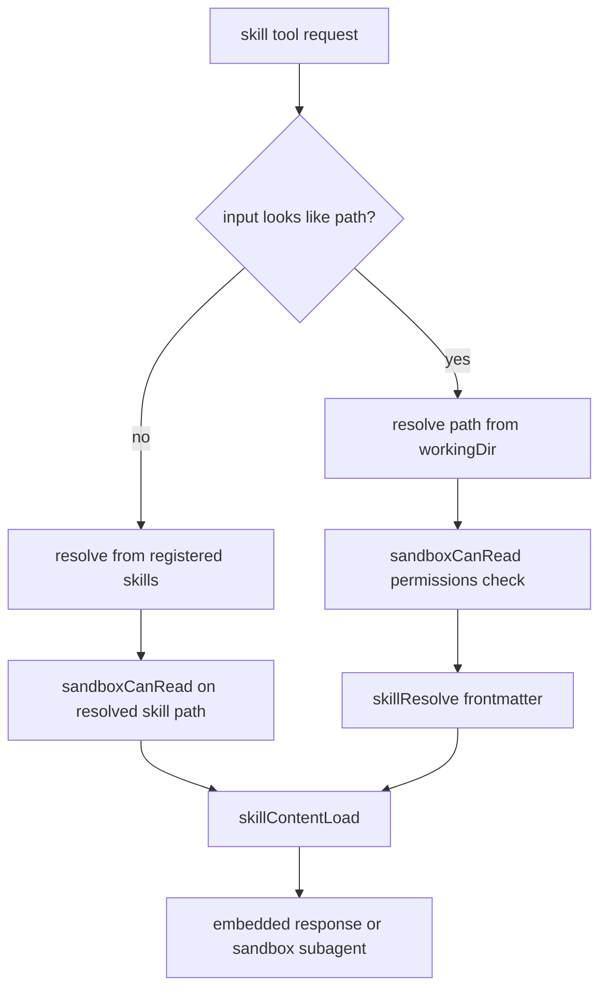

# Skill Tool Read Sandbox Enforcement

## Summary

The `skill` tool now enforces sandbox read permissions before loading any skill file.

Before this change, path-based skill requests could resolve and read `SKILL.md` files without passing through sandbox read checks.

Now both flows are gated by `sandboxCanRead(...)`:
- direct path input (`skill(name: "./path/to/SKILL.md")`)
- named skill input (`skill(name: "deploy")`) before loading the resolved skill body

## Flow

## Security Impact

Skill file reads now honor approved read scope and sandbox deny policy, preventing arbitrary file loading through the `skill` tool.
