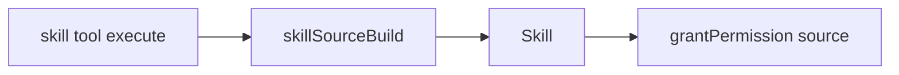
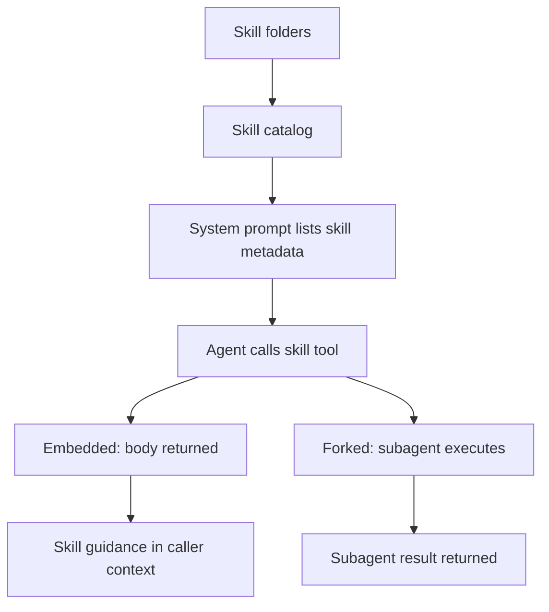
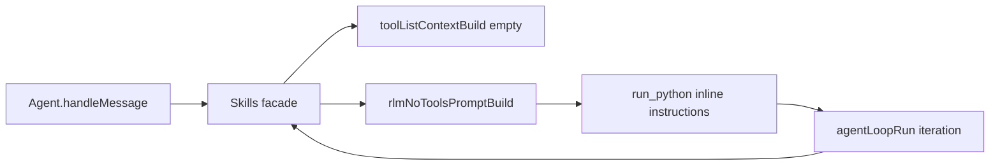

# Skills

Skills are opt-in prompts stored as files on disk. They are **not** loaded into
the system prompt automatically. The agent invokes skills with the `skill` tool.
Depending on skill frontmatter, execution runs in one of two modes:

- **Embedded** (`sandbox` absent/false): tool returns SKILL.md body; caller follows instructions.
- **Forked** (`sandbox: true`): tool spawns a subagent, executes skill+prompt, returns final result.

## Where skills live

Daycare always includes core skills from:
- `packages/daycare/sources/skills/`

Plugins can register additional skills via `registerSkill(path)` with an absolute
path to a `SKILL.md` file.

Skills can also live in the config folder at `.daycare/skills/`. They are loaded
fresh each time the system prompt is built.

Daycare also loads shared user-authored skills from `~/.agents/skills/`.
This source is framework-agnostic so the same skill folder can be reused
across multiple local agent runtimes.

Per-user skills are split into:
- `skills/personal/`: user-authored skills
- `skills/active/`: system-managed activation copies used at runtime

Each skill is a folder containing a `SKILL.md` file. The folder name becomes
the skill name shown to the agent.

Core examples in this repo include:
- `skill-creator`
- `permanent-agent-creator`
- `scheduling`
- `app-creator`

The skills section prompt (`SYSTEM_SKILLS.md`) contains mandatory invocation guidance.
`skillPromptFormat()` contributes only the dynamic XML list (`<available_skills>...</available_skills>`), appended after section render.

## Skills catalog flow (code)

Daycare's skills catalog is coordinated by the `Skills` facade. The facade
reads all five sources (core, config, user personal, plugin, agents) on demand,
then syncs activation copies before inference tool execution.

```mermaid
flowchart TD
  Agent[Agent.handleMessage] --> SkillsFacade[Skills facade]
  SkillsFacade --> Core[skillListCore]
  SkillsFacade --> Config[skillListConfig(configDir/skills)]
  SkillsFacade --> User[skillListUser(users/.../skills/personal)]
  SkillsFacade --> Agents[skillListAgents(~/.agents/skills)]
  SkillsFacade --> Plugin[skillListRegistered]
  Core[skillListCore] --> FromRoot[skillListFromRoot]
  Config --> FromRoot
  User --> FromRoot
  Agents --> FromRoot
  FromRoot --> Resolve[skillResolve]
  Resolve --> Sort[skillSort]
  Plugin --> Resolve
  Plugin --> Sort
  Sort --> SkillsList[combined AgentSkill[]]
  SkillsList --> Sync[skillActivationSync to skills/active]
  SkillsList --> Prompt[skillPromptFormat]
  Agent --> Loop[agentLoopRun]
  Loop --> SkillsFacade
  Loop --> SkillTool[skill tool execute()]
  SkillTool --> ActiveLoad[load from skills/active/<activationKey>/SKILL.md]
  ActiveLoad --> Content[skillContentLoad]
```

## Skill ID prefixes

`skillResolve` generates IDs by source:
- `core:<relative-path>`
- `config:<relative-path>`
- `user:<relative-path>`
- `agents:<relative-path>`
- `plugin:<plugin-id>/<relative-path>`

Activation keys are built from `skill.id` (replace `:` and `/` with `--`, sanitize to `[a-zA-Z0-9._-]`).
This avoids cross-source collisions and path traversal from skill names.

```mermaid
flowchart LR
  SkillId[skill.id] --> Key[skillActivationKeyBuild]
  Key --> ActivePath[skills/active/<activationKey>]
  ActivePath --> Mount[/shared/skills in Docker]
```

## SKILL.md format (Agent Skills spec)

`SKILL.md` must start with YAML frontmatter followed by Markdown content.
Required frontmatter fields:
- `name`: 1-64 chars, lowercase letters/numbers/hyphens only, no leading/trailing
  hyphen, no consecutive hyphens, and it must match the parent folder name.
- `description`: 1-1024 chars describing what the skill does and when to use it.

Optional frontmatter fields include:
- `sandbox` (boolean): when true, run the skill in a forked subagent
- `permissions` (`string[]`): permission tags granted to forked subagent (must be subset of caller)
- `license`, `compatibility`, `metadata`, `allowed-tools`

When a sandboxed skill grants declared permissions to its subagent, the grant
source is labeled as `"<skill-name> Skill"` for permission attribution.



## Loading and unloading

- **Load**: call `skill(name: "...")`; tool resolves metadata and skill body.
- **Read before inference**: skills are read from disk and synced to `skills/active` before each inference call.
- **Unload**: stop calling that skill.



## Inline RLM skill exposure

Inline RLM exposes zero classical tools to inference. Skill metadata remains in
the system prompt and Python can call the `skill(...)` function stub at runtime.


