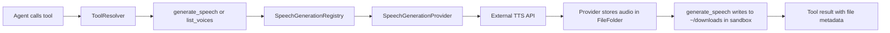

# Speech Generation

The speech generation module adds plugin-driven text-to-speech support through a registry and two core tools:

- `generate_speech`
- `list_voices`

## Runtime flow

## Components

- `SpeechGenerationRegistry`: registers/unregisters providers and resolves them by id
- `SpeechGenerationProvider`: provider contract for generation and optional voice listing
- `PluginRegistrar`: exposes `registerSpeechProvider()` and `unregisterSpeechProvider()`
- `generate_speech` tool: resolves provider, calls generation, writes audio files to sandbox downloads
- `list_voices` tool: aggregates voice discovery from one or more providers

## Plugin-first model

Speech generation is plugin-only for now. Core provider definitions were not extended with built-in speech callbacks.
