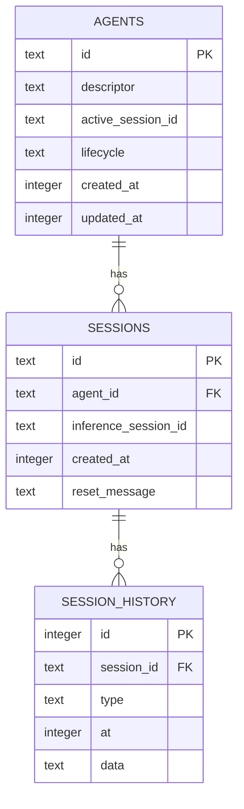
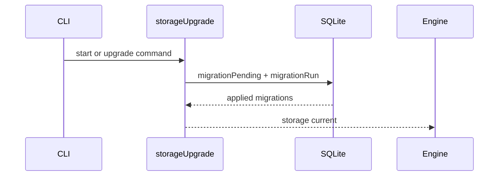
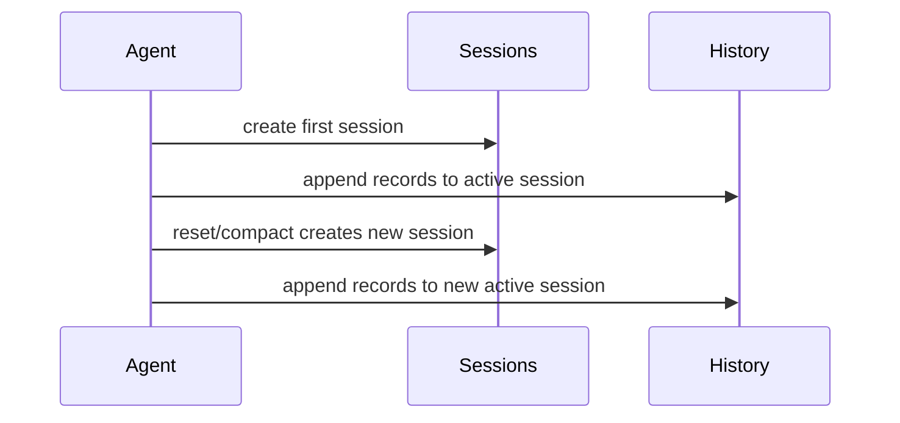

# SQLite Agent Storage

Daycare agent storage moved from per-agent files to a single SQLite database.

Previous layout:
- `agents/<id>/descriptor.json`
- `agents/<id>/state.json`
- `agents/<id>/history.jsonl`

Current layout:
- `<dataDir>/daycare.db` with `agents`, `sessions`, `session_history`, `_migrations`

## Schema summary

- `agents` stores descriptor and persisted state fields (permissions, tokens, stats, lifecycle).
- `sessions` stores per-session metadata and inference session rotation boundaries.
- `session_history` stores append-only records per session.
- `_migrations` tracks applied migration names and times.

## Startup and upgrade

- `daycare start` runs `storageUpgrade()` before loading agents.
- `daycare upgrade` runs the same migration pipeline manually.
- migrations are ordered in `sources/storage/migrations/_migrations.ts`.

## Session model

- each agent has one `active_session_id`
- reset/compaction creates a new session row and updates `active_session_id`
- history records do not use `start`/`reset` markers anymore
- context is rebuilt from active session history on restore

## File import migration

Migration `20260219_import_files` imports legacy file-based agents into SQLite.

- reads existing `agents/<id>/` files
- splits legacy `history.jsonl` by `start` and `reset` into sessions
- writes rows into `agents`, `sessions`, and `session_history`
- sets last imported session as `active_session_id`
