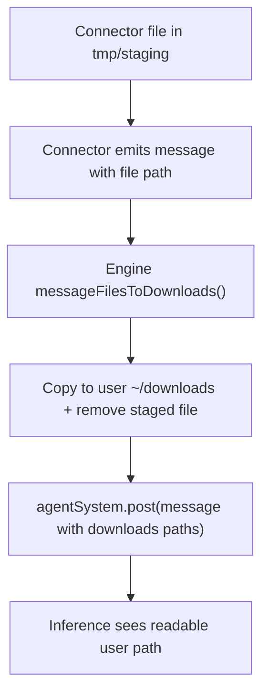

# Staging File Routing For Inference

Incoming connector files are first stored in engine staging, then copied into each user's `~/downloads`
at the connector-to-engine boundary.

## Why

Without boundary routing, downstream agent/inference handling still saw staging paths
(for example `/Users/steve/.dev/tmp/staging/...`), which can be denied by sandbox read rules.

## Flow

