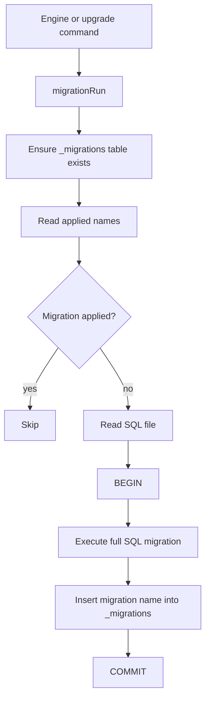

# Storage SQL Migrations

Storage migrations now run from raw `.sql` files instead of TypeScript migration modules.

## Why

- Easier to copy, review, and share migration SQL directly.
- Keeps migration content in one format (SQL) for local and production usage.
- Preserves existing migration names in `_migrations` for compatibility.

## Flow

## Current SQL migration files

- `20260226_bootstrap.sql` - schema bootstrap + owner seed.
- `20260227_user_profile.sql` - adds structured user profile columns.

