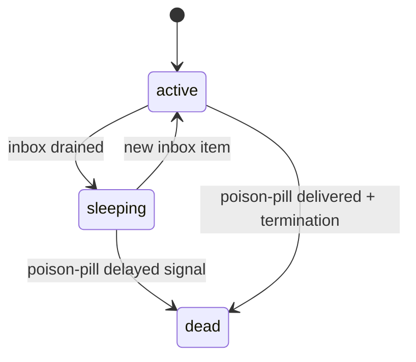

# Subagent Dead State

Subagents now support a terminal lifecycle state: `dead`.

## Lifecycle



## Poison-pill Scheduling

- Only `subagent` descriptors schedule poison-pill delayed signals.
- On sleep:
  - schedule `agent:{agentId}:poison-pill`
  - delay: `3_600_000` ms (1 hour)
  - repeat key: `lifecycle-poison-pill`
- On wake:
  - cancel pending poison-pill signal.
- On load:
  - sleeping subagents schedule poison-pill at `updatedAt + 1h`
  - already-dead subagents are skipped and stale poison-pill signals are cancelled.

## Delivery Flow

```mermaid
flowchart LR
  Sleep[Subagent enters sleeping] --> Delay[DelayedSignals.schedule poison-pill]
  Delay --> Persist[(signals/delayed.json)]
  Persist --> Tick[DelayedSignals.tick]
  Tick --> Generated["signal.generated: agent:{id}:poison-pill"]
  Generated --> AgentSystem[AgentSystem.handlePoisonPill]
  AgentSystem --> DeadWrite[(agents/{id}/state.json = dead)]
  AgentSystem --> DeadEvent["eventBus: agent.dead"]
```

## Runtime Guards

- `restoreAgent()` throws `Agent is dead: {agentId}` for dead state on disk.
- `post()`/`postAndAwait()` throw the same error for dead (or terminating) entries.
- During poison-pill handling for active subagents:
  - termination mode is enabled to reject new queued work immediately
  - poison-pill system message is delivered to the subagent
  - remaining pending completions are rejected with dead-state error.
