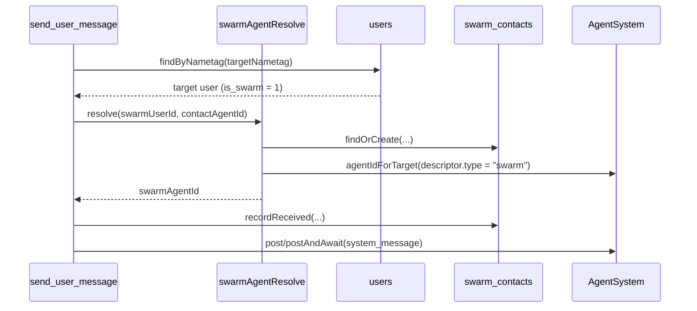

# Swarms internals

Swarms are managed by `sources/engine/swarms/` and discovered from `users` records where `is_swarm = 1`.

## Engine wiring

```mermaid
flowchart LR
    EngineStart[Engine.start] --> Discover[Swarms.discover(ownerUserId)]
    EngineStart --> CreateTool[register swarm_create]
    Swarms --> Mounts[mountsForOwner -> /share/swarm/<nametag>/]
    Mounts --> AgentSystem[AgentSystem.extraMountsForUserId]
```

## Message routing



## Storage

- `users`: swarm identity and runtime profile (`is_swarm`, `first_name`, `last_name`, `bio`, `about`, `system_prompt`, `memory`).
- `swarm_contacts`: per-swarm contact map and message counters.
