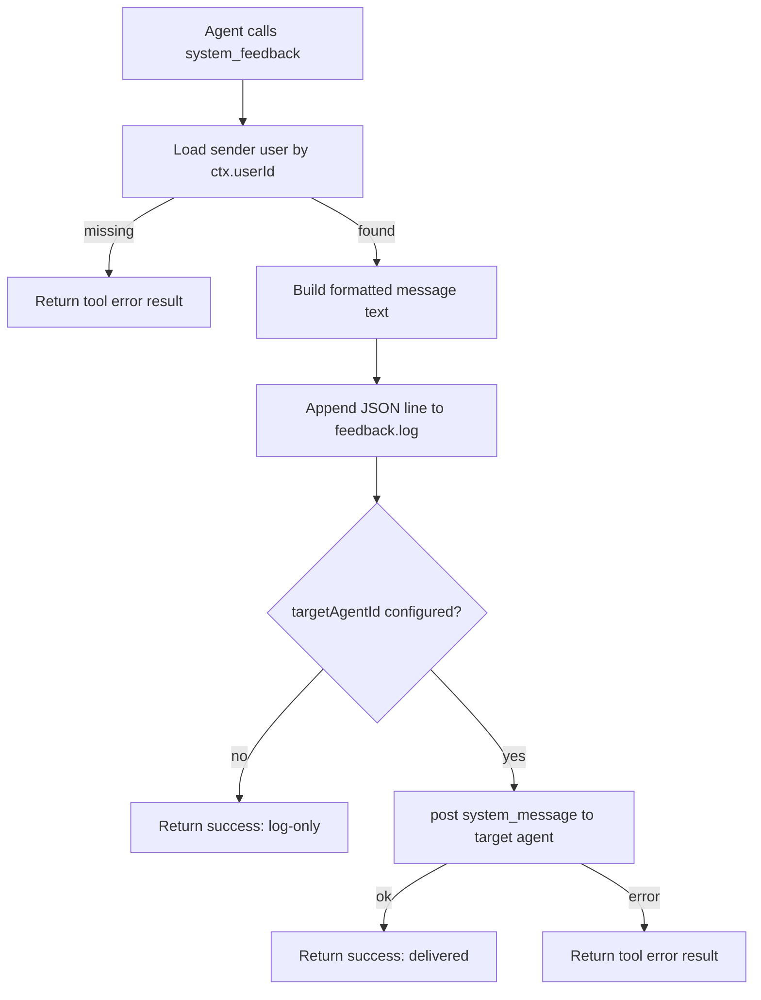

# System Feedback Plugin

## Summary

The `system-feedback` plugin adds a `system_feedback` tool that allows agents to report runtime issues or missing capabilities.

Each tool call:

1. Resolves sender user profile from storage.
2. Builds a structured feedback message with sender metadata.
3. Appends a JSON line to `feedback.log` in the plugin instance data directory.
4. Optionally forwards the message to a configured target agent as a visible `system_message`.

## Data Flow

## Message Envelope

Forwarded feedback uses:

- `type: "system_message"`
- `origin: "plugin:system-feedback"`
- `silent: false`
- `execute: false`

## Log Format

Log file path:

- `{dataDir}/feedback.log`

Each line is JSON with:

- `timestamp`
- `agentId`
- `userId`
- `nametag`
- `name`
- `prompt`
