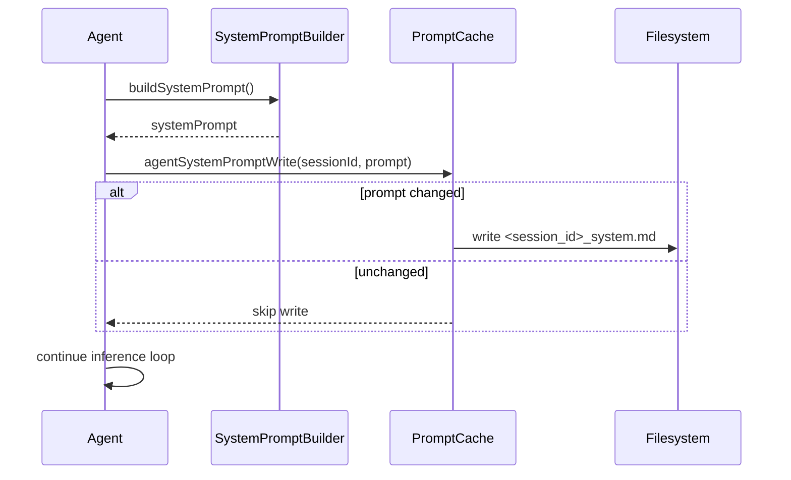

# System Prompt Debug Snapshots

Daycare writes a debug snapshot of the rendered system prompt each time inference starts.
The snapshot lives next to the session history file so operators can compare the prompt with
the exact conversation state on disk.

- Location: `config.agentsDir/<session_id>/<session_id>_system.md`
- Trigger: `Agent.handleMessage()` right after the system prompt is rendered.
- Optimization: an in-memory prompt cache skips disk writes when the prompt is unchanged.

