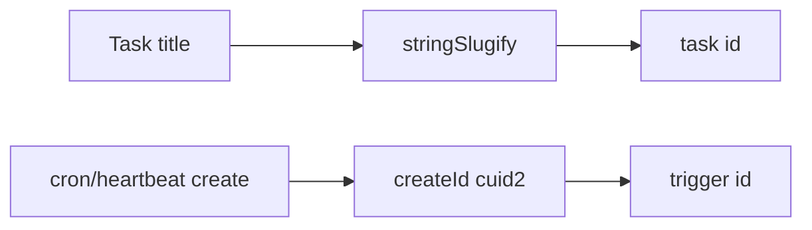
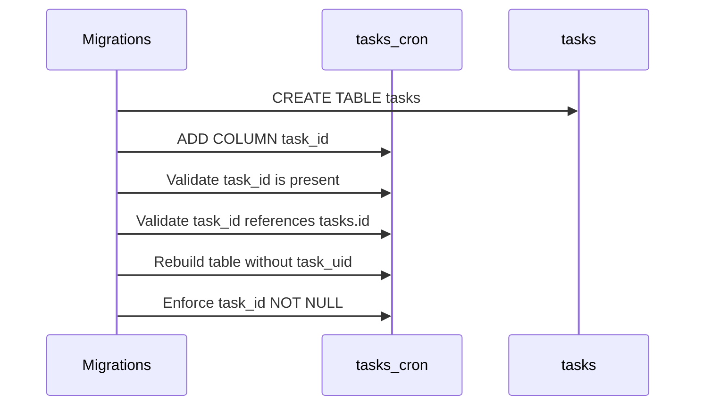
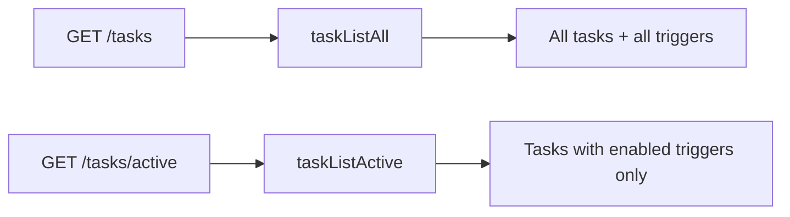

# Tasks Internals

## Schema

```sql
CREATE TABLE tasks (
  id TEXT PRIMARY KEY,
  user_id TEXT NOT NULL,
  title TEXT NOT NULL,
  description TEXT,
  code TEXT NOT NULL,
  created_at INTEGER NOT NULL,
  updated_at INTEGER NOT NULL,
  deleted_at INTEGER
);
```

Trigger tables link to `tasks.id`:
- `tasks_cron.task_id`
- `tasks_heartbeat.task_id`

`tasks_cron.task_uid` is removed and `tasks_cron.task_id` is required.
Legacy trigger `code` columns remain for storage compatibility, but runtime execution reads code from `tasks.code` only.

## ID Semantics

- Task ids are slug ids generated from task titles via `stringSlugify`.
- Duplicate task titles append numeric suffixes (`foo`, `foo-2`, `foo-3`).
- Cron and heartbeat trigger ids default to `cuid2` values.
- Deleting a task sets `deleted_at`; ids remain reserved and are not reused.



## Migration Strategy

1. Add `tasks` table.
2. Add `task_id` columns to trigger tables.
3. Require `tasks_cron.task_id` and remove `tasks_cron.task_uid`.
4. Keep trigger `code` columns as non-authoritative legacy fields.



## API Routes

### `GET /tasks` — all tasks with triggers separated

Returns all tasks for the authenticated user regardless of trigger state, with triggers as a separate collection. Includes disabled cron triggers.

```json
{
  "ok": true,
  "tasks": [
    { "id": "daily-check", "title": "Daily Check", "description": null, "createdAt": 1000, "updatedAt": 2000, "lastExecutedAt": 3000 }
  ],
  "triggers": {
    "cron": [
      { "id": "c1", "taskId": "daily-check", "schedule": "0 9 * * *", "timezone": "UTC", "agentId": null, "enabled": true, "lastExecutedAt": 3000 }
    ],
    "webhook": []
  }
}
```

### `GET /tasks/active` — legacy: only tasks with active triggers

Returns tasks that have at least one enabled trigger. Triggers are nested inside each task object.



## Runtime Resolution

- `CronScheduler` resolves code from `tasksRepository.findById(task_id)` and errors if the linked task is missing.
- `HeartbeatScheduler` resolves each trigger's code from `tasks` and errors if the linked task is missing.
- `Crons` and `Heartbeats` facades delete orphaned tasks when the last trigger is removed.
