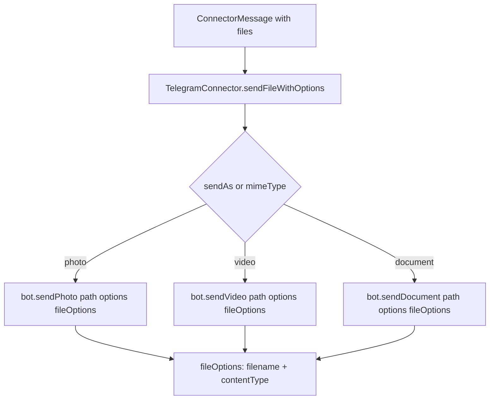

# Telegram File Upload Content Type

## Summary

Telegram file uploads now always include explicit `fileOptions`:

- `filename`: from `ConnectorFile.name`
- `contentType`: from `ConnectorFile.mimeType`

This avoids the `node-telegram-bot-api` deprecation warning about future defaulting to `application/octet-stream`.

## Flow

