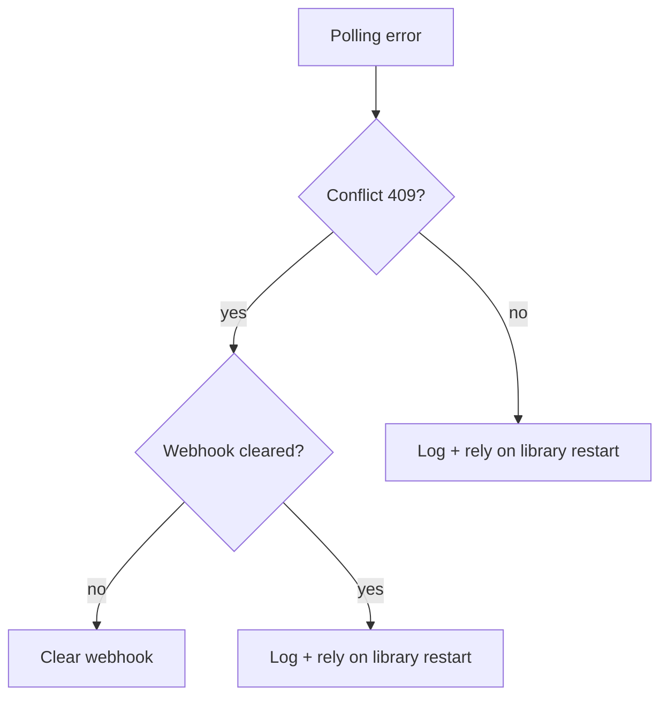

# Telegram polling retry

This note documents how the Telegram connector handles polling errors and conflicts.

## Notes
- Polling restarts are handled by the Telegram library (`restart: true`).
- The connector clears the webhook once when it encounters a 409 conflict.
- Telegram settings no longer accept a `retry` block; backoff is entirely library-managed.
- `startPolling` is guarded to avoid concurrent start attempts while a previous start is still in flight.
