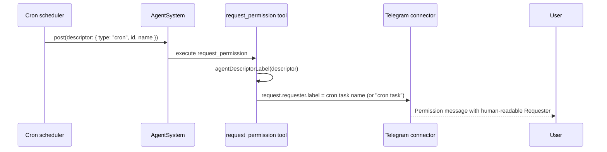

# Telegram requester labels for cron agents

This note documents how permission requester labels now prefer human-readable cron task names.

## Notes
- Cron descriptors may include `name` so labels do not rely on opaque ids.
- `agentDescriptorLabel` now renders cron descriptors as `name` when present.
- Cron fallback label is `cron task` instead of `cron:<id>`.
