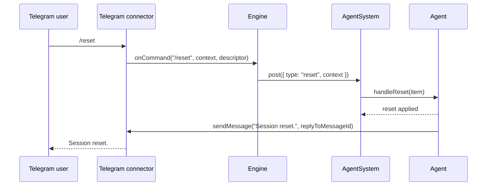

# Telegram reset command confirmation

This note documents the `/reset` command flow when received from Telegram.

## Notes
- The reset command still clears session context with the same reset message payload.
- Engine only routes `/reset` and passes command context to the agent inbox item.
- Agent sends the direct connector response: `Session reset.`.
- The response keeps conversational threading by setting `replyToMessageId` from reset context.
