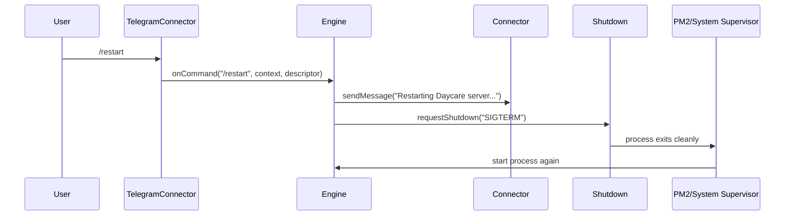

# Telegram restart command

This note documents the `/restart` command flow for restarting the Daycare server process.

- `/restart` is treated as a core slash command and is available even without plugins.
- The engine sends an acknowledgment message before requesting shutdown.
- Actual restart is performed by the runtime supervisor (for example PM2).
