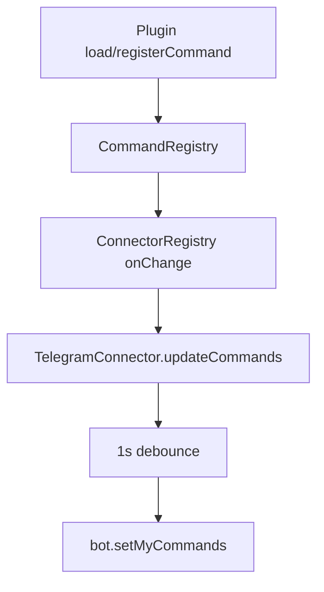
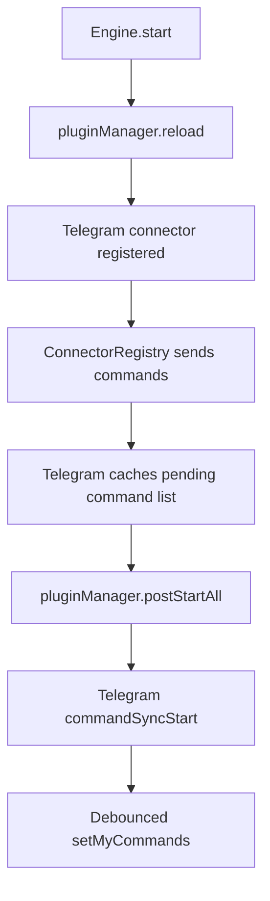

# Telegram Slash Command Registration

Telegram slash commands are pushed dynamically from the runtime command registry.

## Command sources
- Core commands: `/reset`, `/context`, `/compaction`, `/abort`
- Plugin commands: registered through `PluginRegistrar.registerCommand()`
- Example plugin commands: Upgrade plugin registers `/upgrade` and `/restart`

## Sync behavior
- `ConnectorRegistry` merges core + plugin command entries.
- Connectors implementing `updateCommands()` receive updates.
- `TelegramConnector.updateCommands()` debounces `setMyCommands()` calls by 1 second.
- Telegram plugin starts command sync from `postStart()` so initial registration happens after all startup plugin command registrations.

## Runtime flow

## Startup flow

