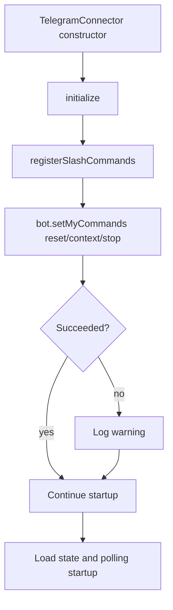

# Telegram Slash Command Registration

The Telegram connector now registers slash commands when it starts. This ensures Telegram clients show command suggestions for supported runtime commands.

## Registered commands
- `/reset` - reset the current conversation.
- `/context` - show the latest context token usage snapshot.
- `/stop` - abort the current inference.

## Startup flow

