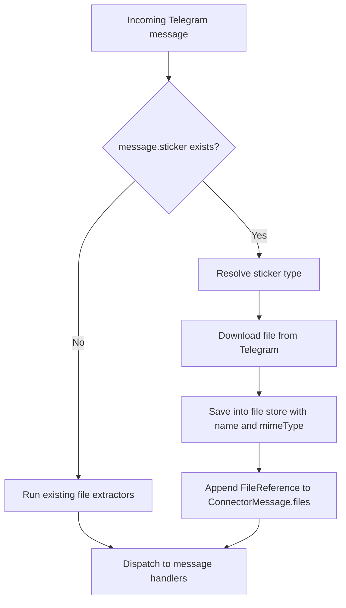

# Telegram Sticker Forwarding

## Summary

Telegram sticker-only messages are now normalized as connector files so the AI can inspect sticker content.
The connector downloads each sticker variant and forwards it via `ConnectorMessage.files`.

## Sticker mapping

- Static sticker: `.webp` + `image/webp`
- Animated sticker: `.tgs` + `application/x-tgsticker`
- Video sticker: `.webm` + `video/webm`

## Flow

