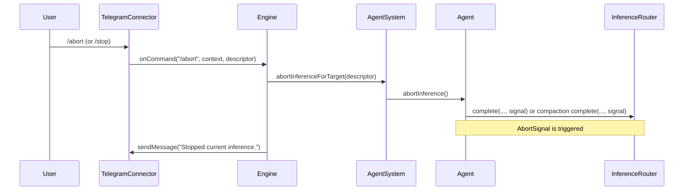

# Telegram stop command

This note documents the `/stop` and `/abort` command flow for aborting an in-flight
inference or compaction call.

- If no active inference exists for the target agent, the engine responds with `No active inference to stop.`.
- Aborted inference exits without sending the generic `Inference failed.` fallback message.
