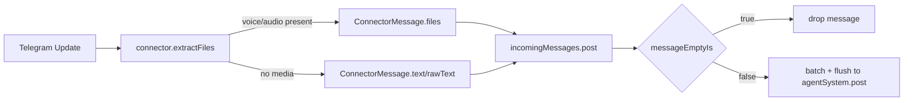

# Telegram Voice + Empty Message Filter

## Summary
- Telegram connector now ingests `voice` and `audio` attachments as files.
- Engine incoming message queue now drops connector payloads that have no text and no files.

## Flow

## Notes
- Voice notes no longer disappear as empty payloads because media is downloaded and attached.
- Empty payloads (e.g. whitespace-only text with no files) are filtered before debounce batching.
