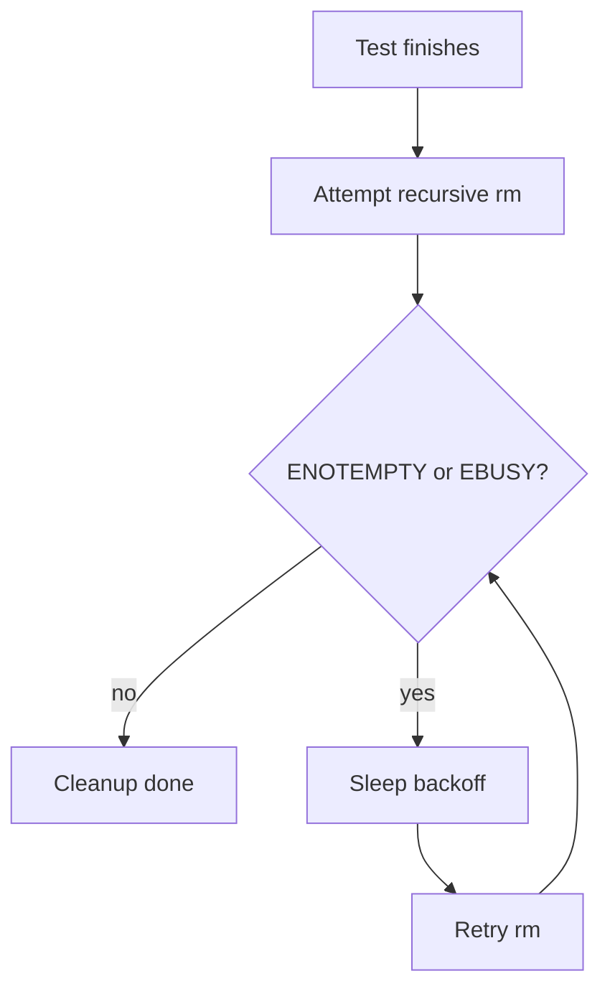
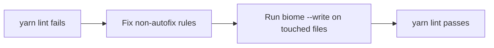

# Test And Lint Stability

## Summary

This change set fixes two classes of failures:

- flaky durable-inbox replay cleanup in `agentSystemDurableInbox.spec.ts`
- repo-wide Biome lint failures in `daycare-app` UI files

## Durable Inbox Test Stabilization

- Added retry-based temp directory cleanup for `ENOTEMPTY`/`EBUSY` races.
- Increased replay assertion wait budget in the restart replay test to reduce full-suite timing flakiness.

## App Lint Remediation

- Removed unused imports/params.
- Replaced `dangerouslySetInnerHTML` style injection with safe style children.
- Reworked agent grid keys to use stable per-block ids (no array index keys).
- Applied Biome formatting/import organization in affected files.

