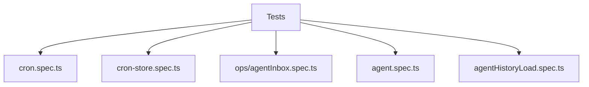

# Testing

Tests live alongside sources and use `*.spec.ts`.

Current coverage:
- `cron.spec.ts` verifies cron scheduler dispatch and cron parsing.
- `cron-store.spec.ts` verifies cron task storage and memory files.
- `agents/ops/agentInbox.spec.ts` verifies inbox sequencing.
- `agents/agent.spec.ts` verifies agent persistence on create.
- `agents/ops/agentHistoryLoad.spec.ts` verifies history reset handling.

