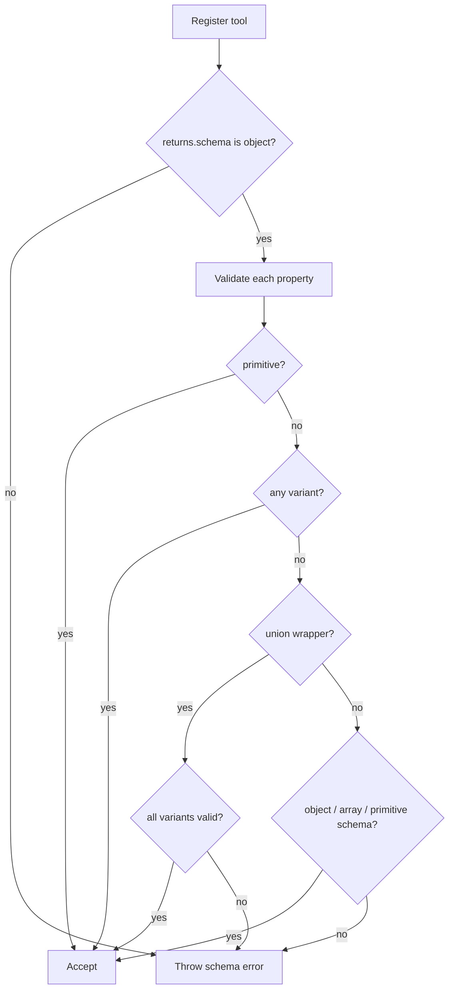

# Tool Return Contracts: Any Variant

## Summary

`ToolResolver` return schema validation allows recursive return-schema shapes. Tools can use nested objects, arrays at any depth, unions, and explicit `Type.Any()` where needed.

## Validation Rules

- Top-level return schema must be an object.
- Property schemas may be:
- primitive (`string`, `number`, `integer`, `boolean`, `null`)
- `any` (`Type.Any()` / `type: "any"`)
- nested objects (including objects inside objects and arrays)
- arrays of any valid property schema (primitives, objects, unions, arrays)
- union wrappers (`anyOf` / `oneOf` / `allOf`) when every variant is valid under these rules
- `additionalProperties` cannot be unrestricted (`true`) at any object level.

## Flow

