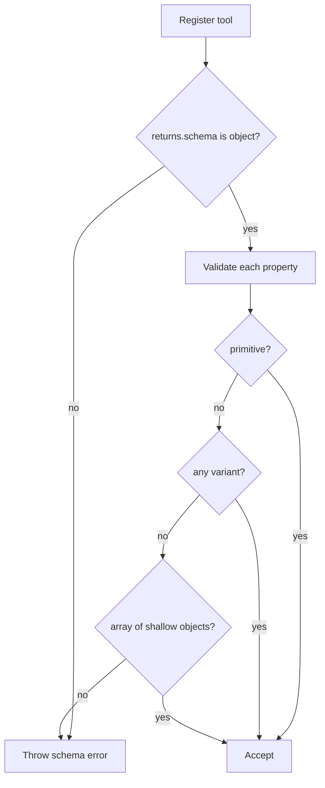

# Tool Return Contracts: Any Variant

## Summary

`ToolResolver` return schema validation now allows an explicit `any` variant (`Type.Any()`) for top-level return properties, while keeping existing shallow constraints for all other schema shapes.

## Validation Rules

- Top-level return schema must be an object.
- Property schemas may be:
- primitive (`string`, `number`, `integer`, `boolean`, `null`)
- `any` (`Type.Any()` / `type: "any"`)
- arrays of shallow objects (object items with primitive-only fields)
- `additionalProperties` cannot be unrestricted (`true`).

## Flow

