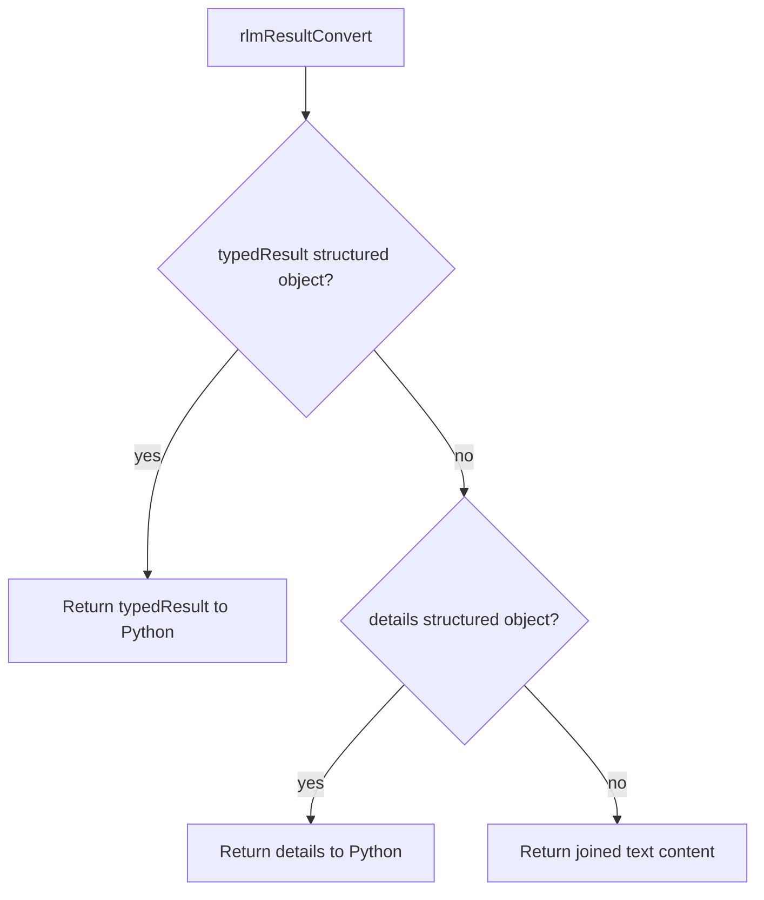
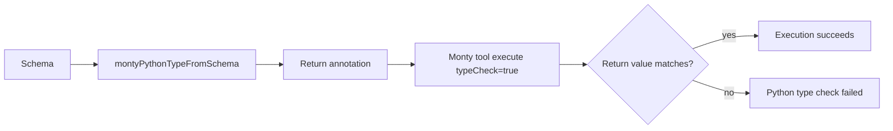

# Tool Return Contracts

Tool execution now supports a typed return contract that keeps outputs both:

- LLM-friendly (text can still be rendered)
- Python-friendly (RLM receives structured values instead of flattened text)

## What changed

- `ToolDefinition` now requires `returns`:
  - `schema` (TypeBox)
  - `toLLMText(result)` converter
- `ToolExecutionResult` now requires `typedResult`.
- `ToolResolver` now:
  - validates `typedResult` against the tool's return schema
  - injects LLM text via `returns.toLLMText` when no text block is present
- `rlmResultConvert` now prefers `typedResult` (then `toolMessage.details`) before text.
- Fallback `{ text }` contracts were replaced across production tools with
  per-tool structured schemas (for example `read`, `write`, `exec`, process tools,
  app tools, expose tools, signal tools, and search/fetch plugins).
- `toolReturnOutcome` remains as a compatibility helper for tests/legacy fixtures;
  production tool registrations now use per-tool contracts.

## Per-tool return mapping

Each tool now declares its own typed output object and keeps LLM rendering explicit.

```mermaid
flowchart LR
  A[Tool logic] --> B[Build structured typedResult]
  B --> C[Return schema check in ToolResolver]
  C --> D[toLLMText(typedResult)]
  D --> E[Assistant-visible text]
  C --> F[RLM typed object]
```

Example pattern:

- `read` -> `{ summary, action, content, path, size, truncated... }`
- `process_start` -> `{ summary, action, processId, status... }`
- `web_search` -> `{ summary, query, resultCount }`
- `app_rules` -> `{ summary, appId, action, changed, approved }`

## Data Flow

```mermaid
flowchart TD
  A[Tool execute()] --> B{typedResult provided?}
  B -->|yes| C[Use typedResult]
  B -->|no| D{details structured object?}
  D -->|yes| E[Use toolMessage.details]
  D -->|no| F[Fallback to object text]
  C --> G[Validate with returns.schema]
  E --> G
  F --> G
  G --> H{toolMessage has text?}
  H -->|no| I[Render text via returns.toLLMText]
  H -->|yes| J[Keep existing content]
  I --> K[ToolExecutionResult with typedResult]
  J --> K
```

## RLM conversion



## RLM preamble test coverage

Monty preamble tests now validate conversion functions directly with exact
string equality assertions:

- `montyPythonTypeFromSchema` converts schema fragments to exact Python hints
- `montyPythonSignatureBuild` emits exact required/optional signatures
- `montyResponseTypeNameFromFunction` case-changes function names into response type names
- `montyResponseTypedDictLinesBuild` builds strict response `TypedDict` declarations
- `montyPreambleBuild` renders exact full preamble text (not partial `contains`)

Monty runtime tests additionally validate that schema-derived Python return
annotations are accepted/rejected by Monty type-checking for major schema kinds
(`string`, `integer`, `number`, `boolean`, `null`, arrays, and objects).

```mermaid
flowchart LR
  A[JSON schema fragment] --> B[montyPythonTypeFromSchema]
  B --> C[Exact type hint string]
  C --> D[montyPythonSignatureBuild]
  D --> E[Exact signature string]
  E --> F[montyResponseTypeNameFromFunction]
  F --> G[montyResponseTypedDictLinesBuild]
  G --> H[montyPreambleBuild]
  H --> I[Exact full preamble string]
```




