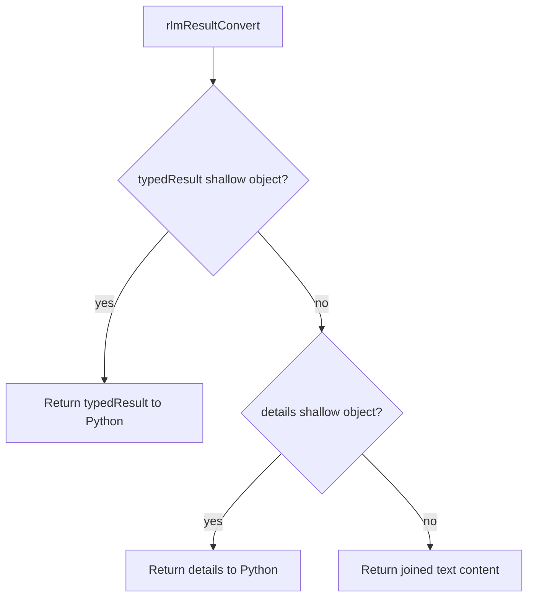

# Tool Return Contracts

Tool execution now supports a typed return contract that keeps outputs both:

- LLM-friendly (text can still be rendered)
- Python-friendly (RLM receives structured values instead of flattened text)

## What changed

- `ToolDefinition` now supports `returns`:
  - `schema` (TypeBox)
  - `toLlmText(result)` converter
- `ToolExecutionResult` now supports `typedResult`.
- `ToolResolver` now:
  - normalizes missing contracts with a shallow-object fallback schema
  - validates `typedResult` against the tool's return schema
  - injects LLM text via `returns.toLlmText` when no text block is present
  - falls back to `toolMessage.details` or `{ text }` when `typedResult` is omitted
- `rlmResultConvert` now prefers `typedResult` (then `toolMessage.details`) before text.

## Data Flow

```mermaid
flowchart TD
  A[Tool execute()] --> B{typedResult provided?}
  B -->|yes| C[Use typedResult]
  B -->|no| D{details shallow object?}
  D -->|yes| E[Use toolMessage.details]
  D -->|no| F[Fallback to object text]
  C --> G[Validate with returns.schema]
  E --> G
  F --> G
  G --> H{toolMessage has text?}
  H -->|no| I[Render text via returns.toLlmText]
  H -->|yes| J[Keep existing content]
  I --> K[ToolExecutionResult with typedResult]
  J --> K
```

## RLM conversion


