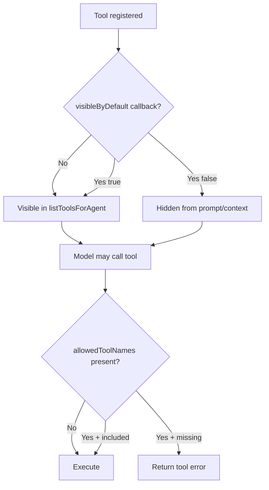

# Tool Visibility And Execution Allowlist

Daycare separates tool exposure from tool execution:

- visibility controls which tools appear in agent prompt/context lists
- execution controls which tool calls are allowed to run

This keeps prompt shaping flexible while preserving strict runtime guards for special agents.

## Visibility

- `ToolDefinition.visibleByDefault(context)` is an optional callback.
- `ToolResolver.listToolsForAgent({ userId, agentId, descriptor })` applies that callback.
- If `visibleByDefault` is not defined, the tool is visible by default.
- Hidden tools are omitted from prompt/context tool lists only.

`memory_node_read` and `memory_node_write` now use `visibleByDefault` so they are shown by default only to `memory-agent` descriptors.

## Execution

- `ToolExecutionContext.allowedToolNames` is an optional execution allowlist.
- `ToolResolver.execute()` blocks calls outside this allowlist with a tool error.
- This does not affect normal agents unless an allowlist is explicitly provided.

For `memory-agent`, runtime allowlist is:

- always: `memory_node_read`, `memory_node_write`
- when RLM is enabled: `run_python`, `skip`

For `memory-search`, runtime allowlist is:

- always: `memory_node_read`, `send_agent_message`
- never: `memory_node_write`

## Flow

