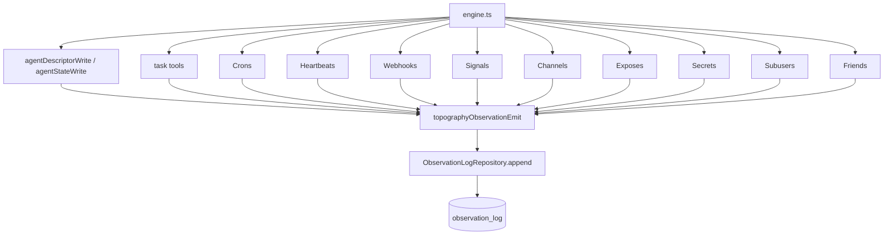

# Topography observation events

Topology mutations now emit structured observation-log events across core facades and tool-driven task mutations.

## Catalog summary

- `agent`: `created`, `updated`, `lifecycle`
- `task`: `created`, `updated`, `deleted`
- `cron`: `added`, `deleted`, `enabled`, `disabled`
- `webhook`: `added`, `deleted`
- `signal`: `subscribed`, `unsubscribed`
- `channel`: `created`, `deleted`, `member_joined`, `member_left`
- `expose`: `created`, `updated`, `removed`
- `secret`: `added`, `removed`
- `subuser`: `created`, `configured`
- `friend`: `requested`, `accepted`, `removed`, `subuser_shared`, `subuser_unshared`

## Wiring

## Scope/query behavior

- Each event stores `userId`, `type`, `source`, `message`, `details`, `data`, and `scopeIds`.
- `scopeIds` includes `userId` and domain IDs when relevant (`agentId`, `channelId`, `subuserId`, peer user IDs).
- `observation_query` can filter by `type`, source prefix, time range, and scope overlap.
