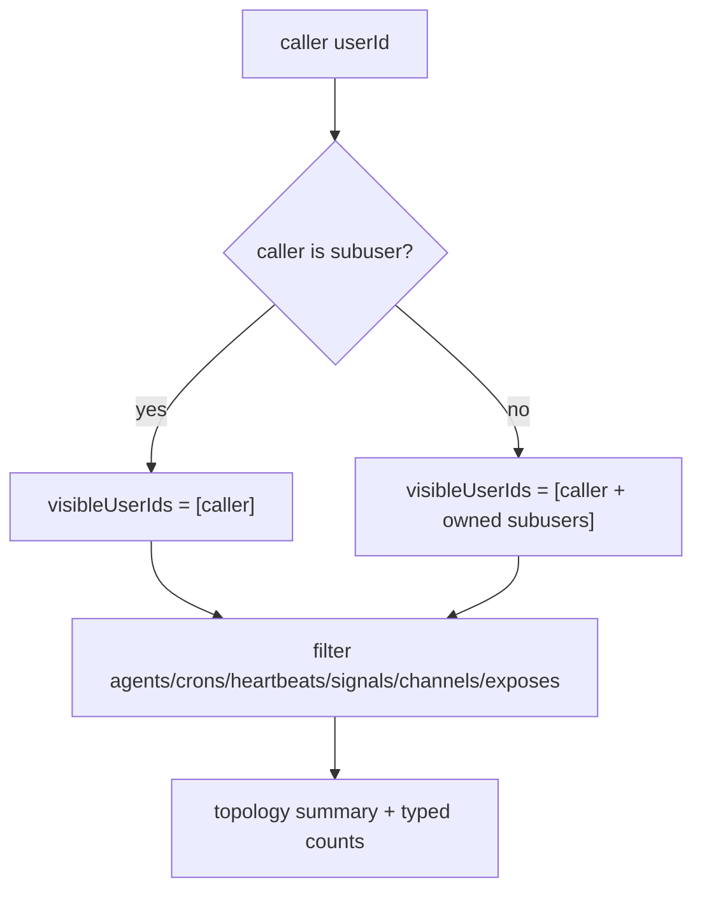

# Topology User Scope Filter

Topology now filters every section by caller-visible user scope instead of mixing in global runtime data.

## Scope

- Agent, cron, heartbeat, signal subscription, channel, and expose sections are filtered to `visibleUserIds`.
- Channel filtering now uses leader-or-member agent visibility, so leader-only channels remain visible.
- Expose endpoints are loaded from storage per visible user (`exposeEndpoints.findMany(ctx)`), not from global expose facade state.
- Friend and subuser sections remain available to non-subuser callers.
