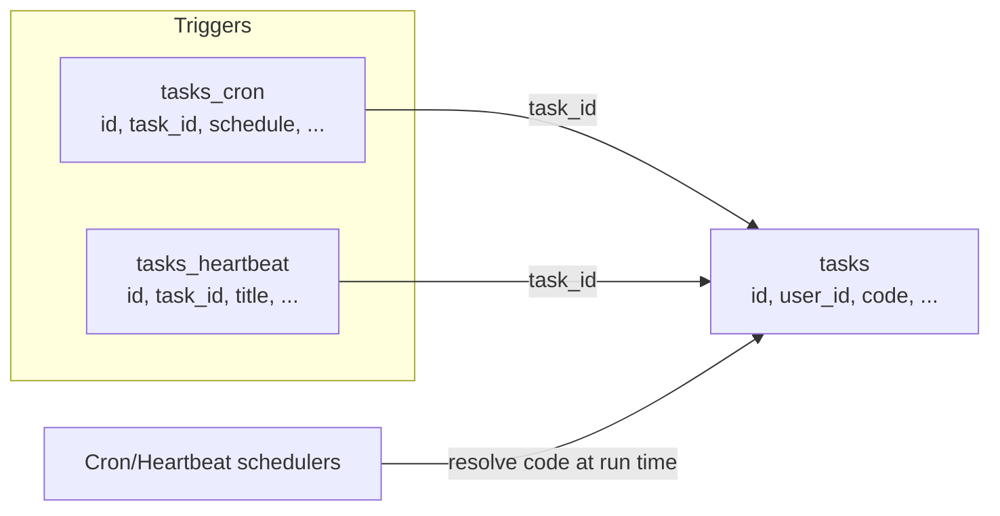

# Trigger Code Source Of Truth

## Summary

Cron and heartbeat trigger tables no longer persist duplicated `code`. Task code now lives only in `tasks.code`.

## Data Flow

## Migration

- Added `20260303_drop_trigger_code`.
- Drops `code` from:
  - `tasks_cron`
  - `tasks_heartbeat`
