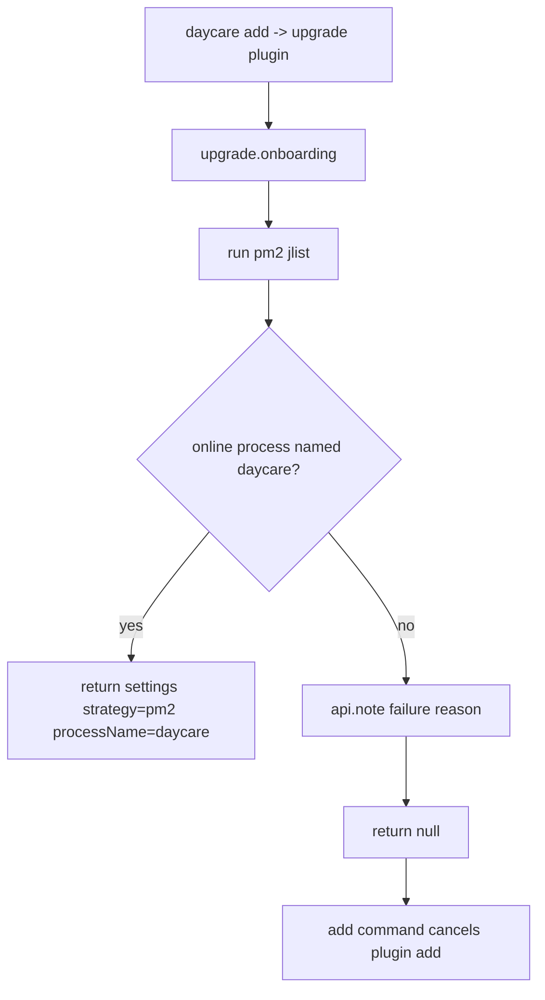

# Upgrade Plugin Onboarding

The Upgrade plugin now has onboarding that auto-detects PM2 readiness before enabling the plugin.

## Behavior
- On plugin add, onboarding runs `pm2 jlist`.
- It requires an **online** PM2 process named `daycare`.
- If missing/unavailable, onboarding returns `null`, so `daycare add` cancels and does not write the plugin into settings.
- If found, onboarding writes settings:
  - `strategy: "pm2"`
  - `processName: "daycare"`

## Flow

