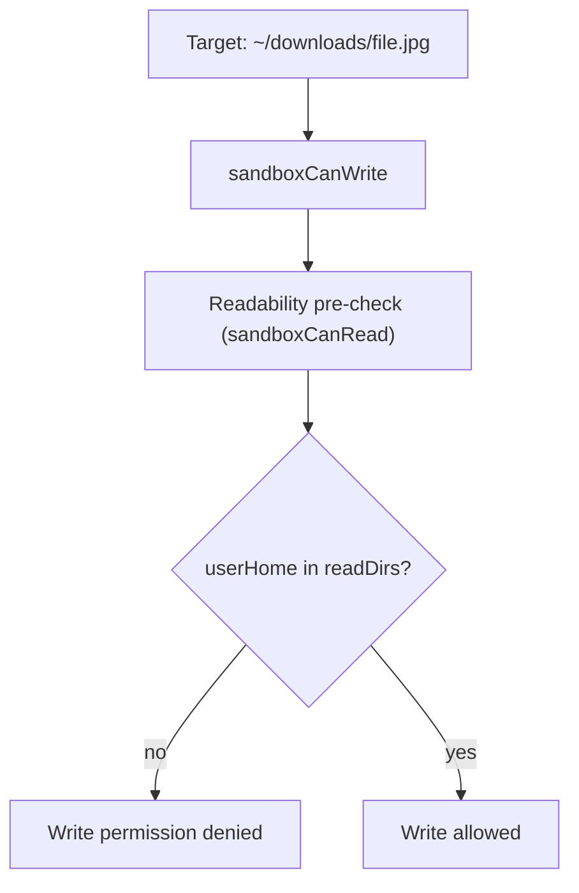

# User Home Downloads Permission Alignment

This change aligns prompt guidance and runtime permission defaults so connector attachments and generated images work from `~/downloads` in user homes that live under `.dev`.

## What changed

- User baseline permissions now include `userHome.home` in `readDirs`.
- User baseline permissions now include `userHome.skillsActive` in `readDirs`.
- User baseline permissions do not include `userHome.skills` or `path.join(configDir, "skills")` in `readDirs`.
- Formatting prompt guidance now points to `~/downloads` for connector/image files.
- Sandbox write coverage now includes a regression test for OS-home nested user homes (for example `/Users/<name>/.dev/users/<id>/home`).

## Why

Writes perform a readability pre-check. When user homes are nested under the OS home path, broad home boundary deny logic blocked reads unless the user home was explicitly readable. This prevented writes to `~/downloads` despite write allowlist access.

