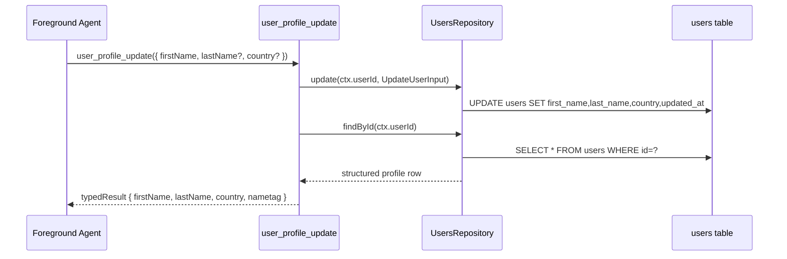

# User Profile Update Tool

This change introduces structured user profile fields in storage and a core tool to update them.

## What Changed

- Added nullable user profile columns in storage:
  - `users.first_name`
  - `users.last_name`
  - `users.country`
- Added migration `20260227_user_profile` to apply the new columns to existing databases.
- Added core tool `user_profile_update` for foreground user agents.
- Extended runtime user API (`GET /v1/engine/users`) to include `firstName`, `lastName`, and `country`.
- Updated environment prompt identity rendering to include structured profile fields when available.

## Data Flow

