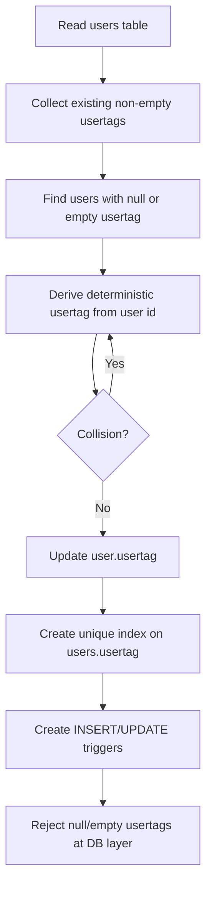

# Required Usertags Migration

This migration makes `users.usertag` required for all existing and future users.

## Summary

- Migration: `20260225_require_usertag`
- Backfills missing/empty usertags for existing rows
- Adds a full unique index on `users(usertag)`
- Adds insert/update triggers that reject null or empty usertags

## Data Flow

## Notes

- Runtime compatibility is preserved by generating a usertag inside `UsersRepository.create()` when callers do not provide one.
- Existing explicit usertag writes continue to work, with uniqueness enforced by DB constraints.
