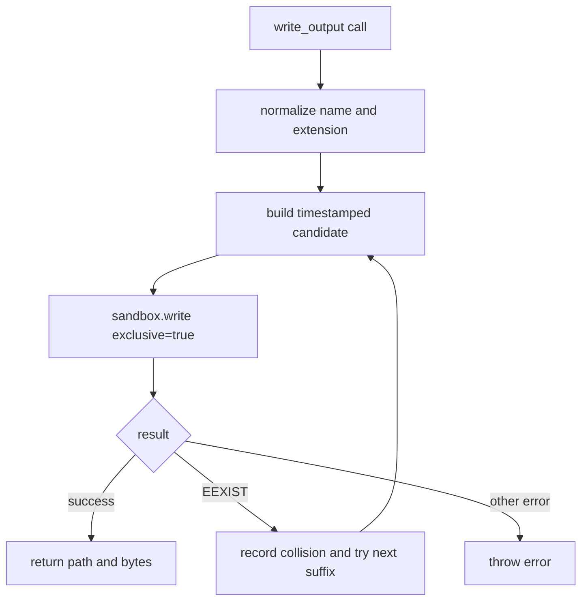

# write_output sandbox collision loop

## Summary
`write_output` no longer lists `~/outputs` using host `fs.readdir` before writing.

Instead, it now:
- generates a date-prefixed candidate name
- attempts `sandbox.write({ exclusive: true })`
- retries with `-1`, `-2`, ... suffixes when `EEXIST` is returned

This keeps all file operations inside the sandbox I/O layer and avoids preflight directory listing failures.

## Sandbox write mode
`sandbox.write()` now supports `exclusive: true` and uses `wx` open mode.

- `exclusive: true` fails with `EEXIST` if the file already exists
- `append: true` and `exclusive: true` together are rejected

## Flow

