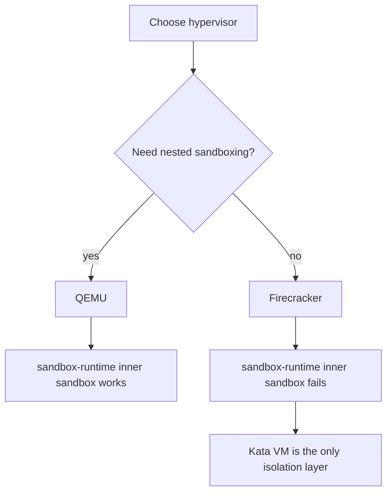
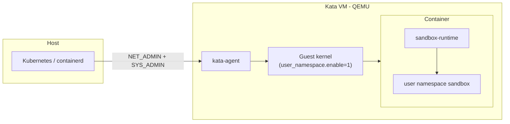

# Kata Containers

Kata Containers run workloads inside lightweight VMs instead of plain Linux containers, providing hardware-level isolation. This doc covers how to configure Kata for use with Daycare sandbox containers.

## Hypervisor: QEMU vs Firecracker

Kata supports two hypervisors. Choose based on your isolation requirements.

### QEMU (recommended)

QEMU supports nested virtualization, which means sandbox-runtime's inner sandbox (user namespaces, seccomp) works correctly inside the Kata VM.

- Full device emulation
- Supports nested user namespaces
- Supports kernel parameter tuning (see below)
- Heavier footprint than Firecracker

### Firecracker

Firecracker is a minimal microVM manager optimized for speed and density.

- Fast boot (~125ms)
- Minimal attack surface
- **Does not support nested virtualization** — sandbox-runtime's inner namespace-based sandbox will fail inside a Firecracker VM
- Use only when the Kata VM itself is the sole isolation boundary



## Docker Version: Downgrade to 27

Docker 28 breaks networking for Kata Containers. Downgrade to Docker 27 and pin it:

```bash
# Latest Docker 27 for Ubuntu 24.04
V="5:27.5.1-1~ubuntu.24.04~noble"

sudo apt-get update
sudo apt-get install -y --allow-downgrades \
  docker-ce="$V" \
  docker-ce-cli="$V" \
  docker-ce-rootless-extras="$V"

# Pin to prevent accidental upgrades
sudo apt-mark hold docker-ce docker-ce-cli docker-ce-rootless-extras
```

## Required Capabilities

The Kata runtime container (the outer pod/container that launches the VM) needs two Linux capabilities:

| Capability | Why |
|------------|-----|
| `NET_ADMIN` | Kata creates tap devices and network bridges to wire the VM's virtual NIC to the host network namespace |
| `SYS_ADMIN` | Kata needs to mount filesystems, create cgroups, and configure namespaces for the VM lifecycle |

Example pod security context:

```yaml
securityContext:
  capabilities:
    add:
      - NET_ADMIN
      - SYS_ADMIN
```

Without these capabilities the Kata runtime will fail at VM creation with permission errors on network or mount operations.

## Enabling User Namespaces in the QEMU Kernel

By default the Kata guest kernel may ship with user namespaces disabled. sandbox-runtime requires user namespaces for its inner sandbox. Enable them via `kernel_params` in the Kata QEMU configuration:

```toml
# /etc/kata-containers/configuration.toml (QEMU section)

[hypervisor.qemu]
kernel_params = "user_namespace.enable=1"
```

If other kernel params are already set, append to the existing string:

```toml
kernel_params = "agent.debug_console agent.log=debug user_namespace.enable=1"
```

### Verifying inside the VM

SSH or exec into a running Kata container and check:

```bash
# Should print "1"
cat /proc/sys/user/max_user_namespaces
```

If the value is `0`, the kernel param was not applied — double-check the configuration file path and that the correct runtime class is selected.

## Putting It Together



### Checklist

1. Select QEMU as the hypervisor (Firecracker cannot do nested sandboxing)
2. Grant `NET_ADMIN` and `SYS_ADMIN` to the Kata runtime container
3. Set `kernel_params = "user_namespace.enable=1"` in the QEMU configuration
4. Verify `max_user_namespaces > 0` inside the guest
5. Deploy — sandbox-runtime's inner sandbox will work inside the Kata VM
