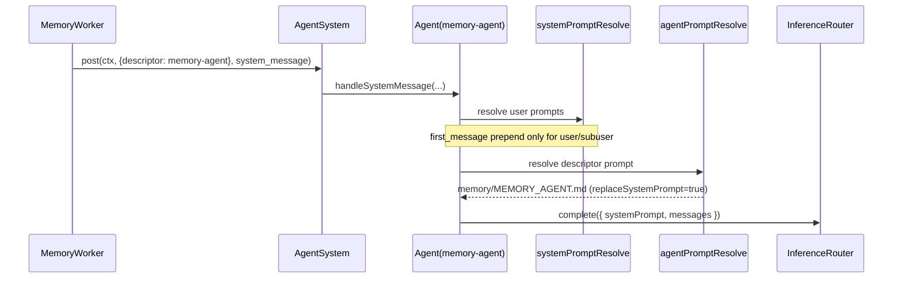

# Memory Agent Prompt Usage

## Summary

This change tightens memory-agent behavior in two ways:

1. `first_message` prompts are no longer prepended for non-user agents, including `memory-agent`.
2. A runtime test now verifies that memory-agent inference receives the `MEMORY_AGENT.md` system prompt and that first-message prompt text is not injected into memory-agent input.

## Flow

## Why

Memory-agent runs should be driven by memory instructions only. Prepending first-message prompts intended for user-facing chat can dilute extraction behavior and cause prompt non-compliance.
