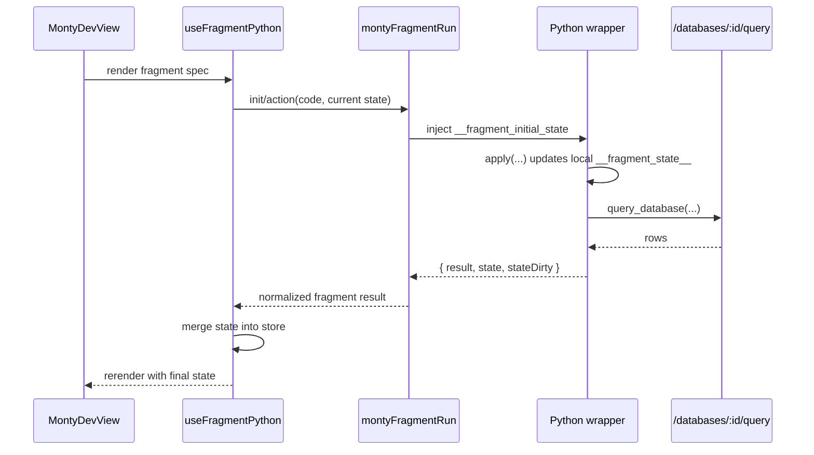

# Monty Fragment Runtime

The Monty fragment bridge now keeps fragment state inside the Python wrapper for each `init()` and action run, then syncs the final state snapshot back into the app store after execution completes.

This avoids depending on side effects from external JS functions during Monty execution and keeps `apply(...)` consistent for:

- synchronous `init()` functions
- async server-backed queries through `query_database(...)`
- action handlers that mutate fragment state before returning

