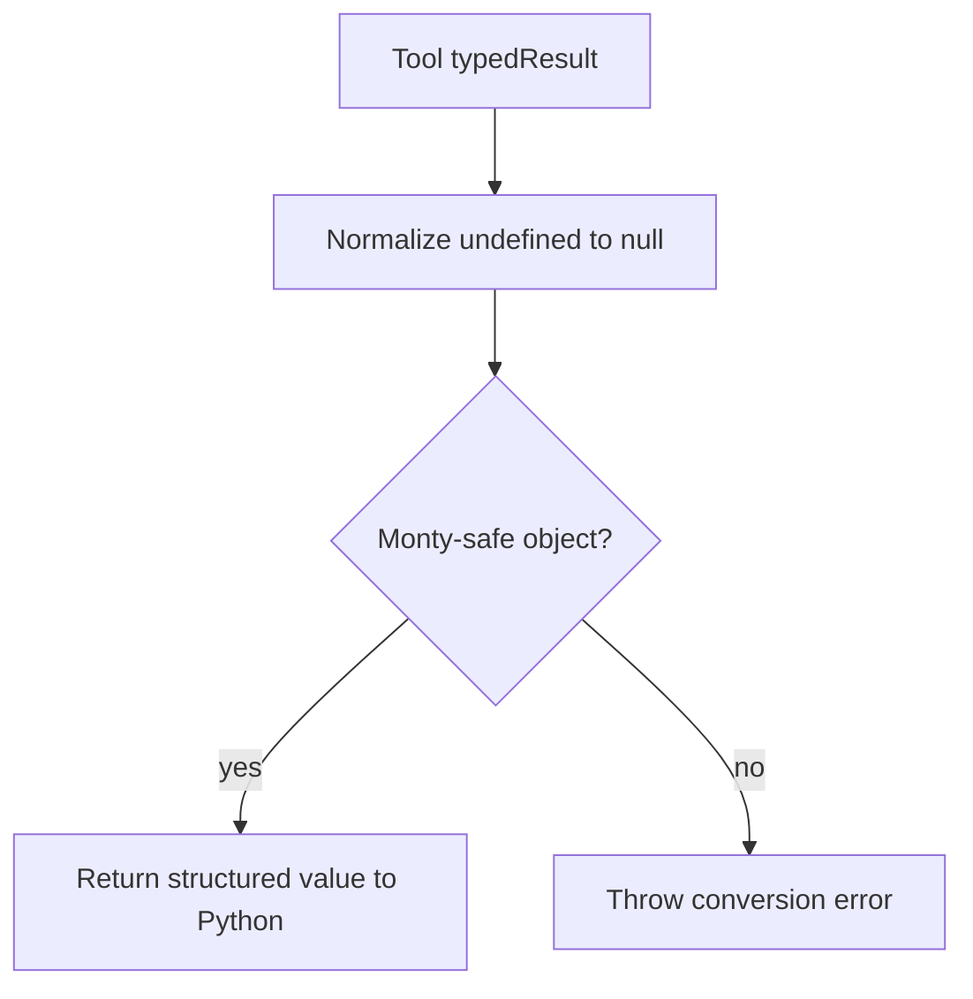

# Monty Tool Result Conversion

Monty tool calls now use a strict structured-result contract.

- tool `typedResult` is returned to Python
- any `undefined` value inside that result is normalized to `null`
- if the normalized result is still not Monty-safe, execution fails immediately
- there is no fallback to tool summary text

