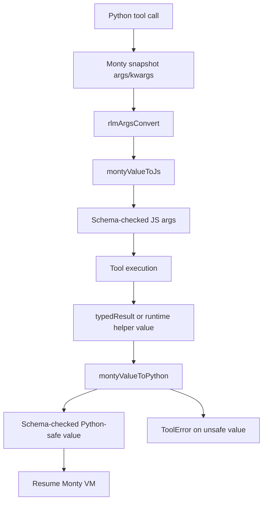
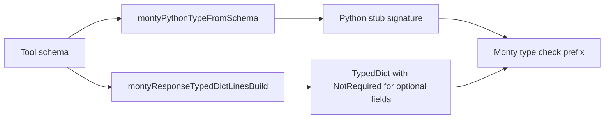

# Monty Tool Serialization

This change tightens the Python tool bridge so Daycare no longer relies on Monty's implicit JS coercions for tool arguments or tool results.

## Rules

- Tool parameter and return schemas must be representable in Monty typing.
- Unsupported schema fragments now fail registration or prompt generation instead of degrading to `Any`.
- Python `None` passed to optional tool arguments is treated as omission, not JSON `null`.
- Tool results are converted back to Python only from explicitly safe JS values.
- Uncastable values throw a tool error; they do not fall back to tool summary text.

## Flow

## Typed Surface

