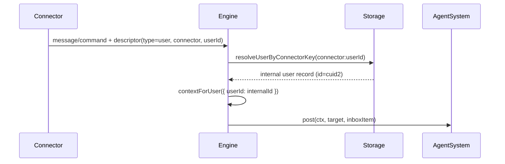

# ctx required + internal user id resolution

## Summary

This change removes internal `Context | string` compatibility shims and requires explicit `Context` across agent and memory operations.

It also fixes descriptor context resolution so user descriptors are mapped from connector identity (`connector:userId`) to the internal users table ID before posting work to `AgentSystem`.

## Key behavior changes

- Internal ops now require `ctx` parameters; raw `agentId` calls were removed.
- `Agent.create` and `Agent.restore` now accept only ctx-based signatures.
- `Memory` methods accept only `ctx`.
- `Engine.descriptorContextResolve` resolves user descriptors via `userConnectorKeyCreate` + `storage.resolveUserByConnectorKey`.
- Resolution errors now preserve original error details via wrapped error cause.

## Flow

