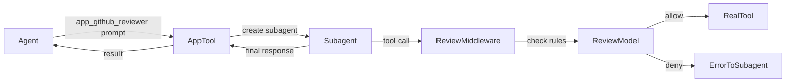

# App Sandbox Agents

## Overview

Introduce a new core concept: **App** — an LLM-sandboxed tool that wraps inference around tool execution. Apps provide a security boundary where every tool call is reviewed by a separate model against configurable rules before execution.

**Key properties:**
- Apps are invoked as individual tools (`app_<name>(prompt)`) — callers prompt, not command
- Each app runs as a special subagent with restricted tools (read, write, edit, exec only)
- Every tool call by the app subagent passes through a **middleware review layer** — a separate inference call checks the call against the app's allow/deny rules
- Apps can only write to `<workspace>/apps/<app-id>/data/` — persistent state across invocations
- App folders are isolated — other agents cannot read/write app directories
- No cron, heartbeat, or agent-management tools — apps are single-invocation subagents
- Installation copies from filesystem and validates structure

**Problem solved:** Agents currently have broad tool access. Apps create an LLM-mediated security boundary so untrusted or semi-trusted capabilities can be safely composed. A "GitHub" app can only do what its rules allow, reviewed per-call.

## Context

**Integration points:**
- `sources/engine/agents/` — subagent creation via `AgentSystem.postAndAwait()`
- `sources/engine/modules/tools/` — tool registration via `ToolResolver`, tool types
- `sources/engine/permissions.ts` — `SessionPermissions` for filesystem isolation
- `sources/sandbox/` — sandbox runtime for shell exec
- `sources/engine/modules/inference/` — `InferenceRouter` for review model calls
- `sources/engine/skills/` — similar discovery pattern (scan folders for manifest files)
- `sources/types.ts` — central type re-exports

**Existing patterns to follow:**
- Skills: folder-based discovery, markdown manifest with YAML frontmatter
- Subagents: `AgentDescriptor.subagent`, `postAndAwait` for sync execution
- Tools: `ToolDefinition<TParams>`, `ToolResolver.register()`, prefix naming
- Permissions: `SessionPermissions.writeDirs` for write isolation
- Sandbox: `sandboxFilesystemPolicyBuild()` for deny/allow policies

## Development Approach
- **Testing approach**: Regular (code first, then tests)
- Complete each task fully before moving to the next
- Make small, focused changes
- **CRITICAL: every task MUST include new/updated tests**
- **CRITICAL: all tests must pass before starting next task**
- **CRITICAL: update this plan file when scope changes during implementation**
- Run tests after each change
- Maintain backward compatibility

## Testing Strategy
- **Unit tests**: required for every task — pure functions get `*.spec.ts` files
- No e2e tests for this feature (backend-only engine code)

## Progress Tracking
- Mark completed items with `[x]` immediately when done
- Add newly discovered tasks with `+` prefix
- Document issues/blockers with warning prefix
- Update plan if implementation deviates from original scope

## Architecture

### App Manifest Format

Apps live at `<workspace>/apps/<app-id>/APP.md` with YAML frontmatter:

```yaml
---
name: github-reviewer
title: GitHub Reviewer
description: Reviews pull requests and provides feedback
model: default
---

## System Prompt

You are a GitHub PR reviewer. When asked to review a PR, read the diff and provide constructive feedback.

## Rules

### Allow
- Read files in the workspace
- Execute git commands
- Read from GitHub API

### Deny
- Write to any file outside data/
- Delete any files
- Access network except github.com
- Modify git history
```

### Filesystem Layout

```
<workspace>/apps/
  github-reviewer/
    APP.md              # manifest (read-only for the app)
    data/               # persistent writable storage
      reviews.json
      cache/
    scripts/            # optional bundled scripts (read-only for the app)
      analyze.sh
```

### Tool Registration Flow



### Rule Review Middleware

Before each tool call by the app subagent:
1. Serialize tool call (name, args) into a review prompt
2. Include the app's allow/deny rules
3. Call review model (configurable per-app, defaults to inference router)
4. Parse response: `ALLOW` or `DENY: <reason>`
5. If denied: return error message to subagent, it can retry/adapt
6. If allowed: forward to real tool executor

### Rule Management Asymmetry

| Action | Confirmation needed? |
|--------|---------------------|
| Add deny rule | No |
| Add allow rule | Yes |
| Remove deny rule | Yes |
| Remove allow rule | No |

Rationale: tightening security (add deny, remove allow) needs no confirmation. Loosening security (add allow, remove deny) requires explicit approval.

### Permission Isolation

- App subagent `SessionPermissions.writeDirs` = `[<workspace>/apps/<app-id>/data/]`
- App subagent `SessionPermissions.readDirs` = `[<workspace>/]` (workspace access)
- Other agents: `<workspace>/apps/` added to their deny-read/deny-write lists
- App's own folder (except `data/`) is read-only to the app itself

## Implementation Steps

### Task 1: Define app types and manifest parser

Create the core types and manifest loading/validation functions.

**Files:** `sources/engine/apps/appTypes.ts`, `sources/engine/apps/appManifestParse.ts`, `sources/engine/apps/appManifestValidate.ts`

- [x] Create `sources/engine/apps/appTypes.ts` with types:
  - `AppManifest`: `{ id: string; name: string; description: string; model?: string; systemPrompt: string; rules: AppRuleSet }`
  - `AppRuleSet`: `{ allow: AppRule[]; deny: AppRule[] }`
  - `AppRule`: `{ text: string; addedBy?: string }`
  - `AppDescriptor`: `{ id: string; path: string; manifest: AppManifest }`
- [x] Create `sources/engine/apps/appManifestParse.ts` — parse `APP.md` frontmatter + body sections (system prompt, rules)
- [x] Create `sources/engine/apps/appManifestValidate.ts` — validate id format (username-style: lowercase, hyphens, no spaces), required fields, rule structure
- [x] Re-export app types from `sources/types.ts`
- [x] Write tests for `appManifestParse` (valid manifest, missing fields, malformed YAML)
- [x] Write tests for `appManifestValidate` (valid ids, invalid ids, missing required fields)
- [x] Run tests — must pass before next task

### Task 2: App discovery from workspace

Scan `<workspace>/apps/` for installed apps and build descriptors.

**Files:** `sources/engine/apps/appDiscover.ts`

- [x] Create `sources/engine/apps/appDiscover.ts` — scan `<workspace>/apps/*/APP.md`, parse each manifest, return `AppDescriptor[]`
- [x] Handle errors gracefully (skip apps with invalid manifests, log warnings)
- [x] Write tests for `appDiscover` (mock filesystem with valid/invalid apps, empty directory)
- [x] Run tests — must pass before next task

### Task 3: Build app permission isolation

Create the permission-building logic that restricts app subagents to their `data/` folder.

**Files:** `sources/engine/apps/appPermissionBuild.ts`

- [x] Create `sources/engine/apps/appPermissionBuild.ts` — build `SessionPermissions` for an app:
  - `workingDir`: `<workspace>/apps/<app-id>/data/`
  - `writeDirs`: `[<workspace>/apps/<app-id>/data/]`
  - `readDirs`: `[<workspace>/]` (workspace readable)
  - `network`: `false` (default, rules can override)
  - `events`: `false`
- [x] Ensure `data/` directory is created if it doesn't exist
- [x] Write tests for `appPermissionBuild` (paths are correct, data dir handling)
- [x] Run tests — must pass before next task

### Task 4: Build the rule review middleware

Create the LLM-based tool call reviewer that checks each call against app rules.

**Files:** `sources/engine/apps/appToolReview.ts`, `sources/engine/apps/appReviewPromptBuild.ts`

- [x] Create `sources/engine/apps/appReviewPromptBuild.ts` — build the review prompt from tool call details + rules:
  - Format: tool name, arguments (serialized), allow rules, deny rules
  - Ask model to respond with `ALLOW` or `DENY: <reason>`
- [x] Create `sources/engine/apps/appToolReview.ts` — the review function:
  - Takes: tool call, app rules, inference router, model config
  - Calls review model with the built prompt
  - Parses response to extract allow/deny decision
  - Returns `{ allowed: boolean; reason?: string }`
- [x] Write tests for `appReviewPromptBuild` (prompt contains tool name, args, rules)
- [x] Write tests for `appToolReview` response parsing (ALLOW, DENY with reason, malformed responses)
- [x] Run tests — must pass before next task

### Task 5: Build the reviewing tool executor wrapper

Create a `ToolResolver`-compatible wrapper that intercepts tool calls through the review middleware.

**Files:** `sources/engine/apps/appToolExecutorBuild.ts`

- [x] Create `sources/engine/apps/appToolExecutorBuild.ts` — wraps a `ToolResolver` with review logic:
  - Before each `execute()`: call `appToolReview()` with the tool call
  - If denied: return error `ToolResultMessage` with denial reason (subagent can retry)
  - If allowed: forward to real `ToolResolver.execute()`
  - Log all review decisions via app logger
- [x] Write tests for the wrapper (allowed calls pass through, denied calls return error, review errors handled)
- [x] Run tests — must pass before next task

### Task 6: Build app execution as subagent

Create the function that runs an app as a subagent with restricted tools and the reviewing executor.

**Files:** `sources/engine/apps/appExecute.ts`

- [x] Create `sources/engine/apps/appExecute.ts`:
  - Build app permissions via `appPermissionBuild`
  - Create subagent descriptor with `type: "subagent"`, `name: "app:<app-id>"`
  - Configure system prompt from manifest
  - Post prompt to subagent via `agentSystem.postAndAwait()`
  - Return the subagent's final response as the tool result
- [x] Determine how to inject the reviewing tool executor into the subagent's inference loop (may need to pass a custom tool resolver or intercept at the agent level)
- [x] Write tests for `appExecute` setup logic (permissions, descriptor construction)
- [x] Run tests — must pass before next task

### Task 7: Build per-app tool registration

Create the tool definition that exposes each app as `app_<name>`.

**Files:** `sources/engine/apps/appToolBuild.ts`

- [x] Create `sources/engine/apps/appToolBuild.ts` — given an `AppDescriptor`, build a `ToolDefinition`:
  - Tool name: `app_<name>` (hyphens replaced with underscores for valid tool names)
  - Tool description: from manifest description
  - Parameters: `{ prompt: string }` (TypeBox schema)
  - Execute: calls `appExecute()` with the prompt
- [x] Write tests for `appToolBuild` (tool name formatting, description, parameter schema)
- [x] Run tests — must pass before next task

### Task 8: Build the app manager facade

Create the `Apps` facade class that coordinates discovery, registration, and lifecycle.

**Files:** `sources/engine/apps/appManager.ts`

- [x] Create `sources/engine/apps/appManager.ts` — `Apps` class:
  - `discover(workspaceDir)`: scan for apps, validate manifests
  - `registerTools(toolResolver)`: register `app_<name>` tools for each discovered app
  - `unregisterTools(toolResolver)`: unregister all app tools
  - `list()`: return discovered apps
  - `get(id)`: return specific app descriptor
- [x] Wire into engine startup — call `apps.discover()` and `apps.registerTools()` during engine initialization
- [x] Write tests for `Apps` facade (discovery integration, tool registration/unregistration)
- [x] Run tests — must pass before next task

### Task 9: Build app installation tool

Create the `install_app` tool that copies an app from a source directory and validates it.

**Files:** `sources/engine/apps/appInstallToolBuild.ts`, `sources/engine/apps/appInstall.ts`

- [x] Create `sources/engine/apps/appInstall.ts` — the install logic:
  - Copy source directory to `<workspace>/apps/<app-id>/`
  - Validate the copied manifest via `appManifestValidate`
  - Create `data/` subfolder
  - Return the validated `AppDescriptor`
- [x] Create `sources/engine/apps/appInstallToolBuild.ts` — `ToolDefinition` for `install_app`:
  - Parameters: `{ source: string }` (path to source directory containing APP.md)
  - Validates source exists and contains valid APP.md
  - Copies to workspace apps directory
  - Re-runs app discovery to register the new app's tool
- [x] Write tests for `appInstall` (valid install, invalid manifest, already exists)
- [x] Run tests — must pass before next task

### Task 10: Build app rule management tools

Create tools for adding/removing allow and deny rules with the asymmetric confirmation model.

**Files:** `sources/engine/apps/appRuleToolBuild.ts`, `sources/engine/apps/appRuleApply.ts`

- [x] Create `sources/engine/apps/appRuleApply.ts` — apply rule changes to an app manifest:
  - `appRuleAddDeny(manifest, rule)` — add deny rule, no confirmation needed
  - `appRuleAddAllow(manifest, rule)` — add allow rule, requires confirmation flag
  - `appRuleRemoveDeny(manifest, rule)` — remove deny rule, requires confirmation flag
  - `appRuleRemoveAllow(manifest, rule)` — remove allow rule, no confirmation needed
  - Persist updated rules back to APP.md
- [x] Create `sources/engine/apps/appRuleToolBuild.ts` — `ToolDefinition` for `app_rules`:
  - Parameters: `{ app_id, action: "add_deny"|"add_allow"|"remove_deny"|"remove_allow", rule: string, confirmed?: boolean }`
  - Enforce confirmation requirements: return confirmation request if needed
  - Apply rule change via `appRuleApply`
- [x] Write tests for `appRuleApply` (all 4 operations, confirmation enforcement)
- [x] Run tests — must pass before next task

### Task 11: Enforce filesystem isolation for other agents

Prevent other agents from reading/writing app directories.

**Files:** modifications to `sources/sandbox/sandboxFilesystemPolicyBuild.ts` or `sources/engine/permissions/`

- [x] Add `<workspace>/apps/` to the deny-read and deny-write lists for non-app agents
  - Determine the right integration point: either sandbox policy build or permission defaults
  - App subagents override this with their specific app path allowed
- [x] Ensure app subagents can still read their own app folder and the workspace
- [x] Write tests for isolation (non-app agent denied, app agent allowed for own folder)
- [x] Run tests — must pass before next task

### Task 12: Wire into engine startup

Connect the app system to the engine initialization flow.

**Files:** modifications to `sources/engine/engine.ts` (or equivalent startup file)

- [x] Initialize `Apps` manager during engine startup
- [x] Call `apps.discover()` to find installed apps
- [x] Register app tools with the tool resolver
- [x] Register `install_app` tool
- [x] Register `app_rules` tool
- [x] Write tests for engine integration (apps discovered on startup, tools registered)
- [x] Run tests — must pass before next task

### Task 13: Update topology documentation

Document the new app agent type in topology-facing documentation.

- [x] Add app subagent details to topology documentation/examples
- [x] Add review model interaction to topology notes if applicable
- [x] Update mermaid diagram showing app execution flow
- [x] Verify topology documentation is consistent with implementation

### Task 14: Verify acceptance criteria

- [x] Verify: apps are discovered from `<workspace>/apps/` on startup
- [x] Verify: each app registers as `app_<name>` tool
- [x] Verify: app invocation creates subagent with restricted permissions
- [x] Verify: every tool call goes through LLM review middleware
- [x] Verify: denied calls return error, subagent can adapt
- [x] Verify: apps can only write to their `data/` subfolder
- [x] Verify: other agents cannot read/write app directories
- [x] Verify: `install_app` copies and validates from filesystem
- [x] Verify: rule management respects confirmation asymmetry
- [x] Run full test suite (unit tests)
- [x] Run linter — all issues must be fixed

### Task 15: Update documentation

- [x] Create `doc/concepts/apps.md` with concept overview and usage guide
- [x] Update `doc/PLUGINS.md` or relevant docs to reference apps as an alternative pattern
- [x] Add mermaid diagrams showing app architecture and execution flow

## Technical Details

### Data Structures

```typescript
// App manifest parsed from APP.md
type AppManifest = {
  id: string;           // username-style: lowercase, hyphens, no spaces
  name: string;         // display name
  description: string;  // what the app does
  model?: string;       // review model override (default: use inference router)
  systemPrompt: string; // from markdown body
  rules: AppRuleSet;
};

type AppRuleSet = {
  allow: AppRule[];
  deny: AppRule[];
};

type AppRule = {
  text: string;         // human-readable rule description
  addedBy?: string;     // who added the rule (for audit)
};

type AppDescriptor = {
  id: string;           // matches manifest.name
  path: string;         // absolute path to app folder
  manifest: AppManifest;
};

// Review decision from the middleware
type AppReviewDecision = {
  allowed: boolean;
  reason?: string;      // present on denial
};
```

### Review Prompt Format

```
You are a security reviewer for the app "${appName}".
A tool call is being made. Decide if it should be ALLOWED or DENIED based on the rules below.

## Tool Call
- Tool: ${toolName}
- Arguments: ${JSON.stringify(args, null, 2)}

## Allow Rules
${allowRules.map(r => `- ${r.text}`).join('\n')}

## Deny Rules
${denyRules.map(r => `- ${r.text}`).join('\n')}

Respond with exactly one of:
- ALLOW
- DENY: <reason>
```

### Processing Flow

1. Agent calls `app_github_reviewer({ prompt: "Review PR #42" })`
2. `appToolBuild` handler invokes `appExecute()`
3. `appExecute` creates subagent with:
   - Permissions: write only to `apps/github-reviewer/data/`, read workspace
   - System prompt: from APP.md
   - Tools: read, write, edit, exec (wrapped with review middleware)
4. Subagent runs inference loop, making tool calls
5. Each tool call → `appToolReview()` → review model checks rules → ALLOW/DENY
6. Subagent completes, final response returned to caller

## Post-Completion

**Manual verification:**
- Test with a real app (e.g., a simple note-taking app) to validate the full flow
- Test rule review with adversarial prompts (trying to bypass rules)
- Verify sandbox isolation by attempting cross-app access
- Performance testing: measure latency overhead of per-call review

**Future considerations (out of scope):**
- App marketplace/registry for sharing apps
- App versioning and updates
- App-to-app communication
- Resource limits (max tool calls, max inference tokens per invocation)
- Caching review decisions for repeated identical tool calls
