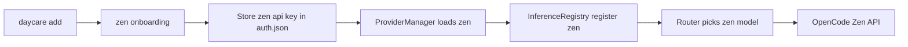

# Zen

OpenCode Zen gateway provider.

## Authentication

- **Type:** apiKey
- **Auth key:** `zen`
- **Endpoint:** `https://opencode.ai/zen/v1`

## Runtime flow

## Models (hardcoded in source)

Source of truth: `packages/daycare/sources/providers/zen.ts`.

- `claude-opus-4-6`
- `claude-opus-4-5`
- `claude-opus-4-1`
- `claude-sonnet-4-6`
- `claude-sonnet-4-5`
- `claude-sonnet-4`
- `claude-3-5-haiku`
- `claude-haiku-4-5`
- `gemini-3.1-pro`
- `gemini-3-pro`
- `gemini-3-flash`
- `gpt-5.3-codex`
- `gpt-5.2`
- `gpt-5.2-codex`
- `gpt-5.1`
- `gpt-5.1-codex-max`
- `gpt-5.1-codex`
- `gpt-5.1-codex-mini`
- `gpt-5`
- `gpt-5-codex`
- `gpt-5-nano`
- `glm-5`
- `glm-4.7`
- `glm-4.6`
- `minimax-m2.5`
- `minimax-m2.5-free`
- `minimax-m2.1`
- `minimax-m2.1-free`
- `kimi-k2.5`
- `kimi-k2.5-free`
- `kimi-k2`
- `kimi-k2-thinking`
- `trinity-large-preview-free`
- `big-pickle`
- `glm-5-free`
