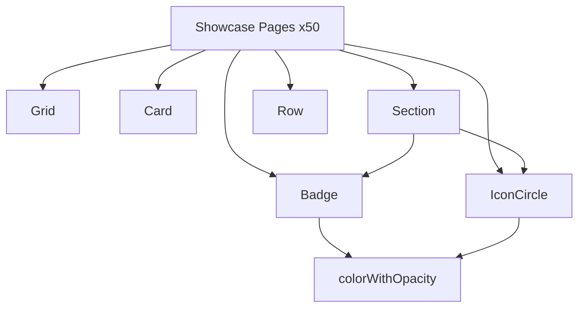

# Showcase Design System Migration (2026-03-04)

## Summary

Implemented shared showcase layout primitives in `packages/daycare-app/sources/components`:
- `Grid`
- `Card`
- `Section`
- `Badge`
- `IconCircle`
- `Row`

Migrated all 50 showcase pages to consume the new design-system primitives (automated pass + manual completion).

## Architecture

## Migration Flow

## Verification

- `yarn lint`
- `yarn typecheck`
- `yarn test`
- `yarn build`

All commands completed successfully.
