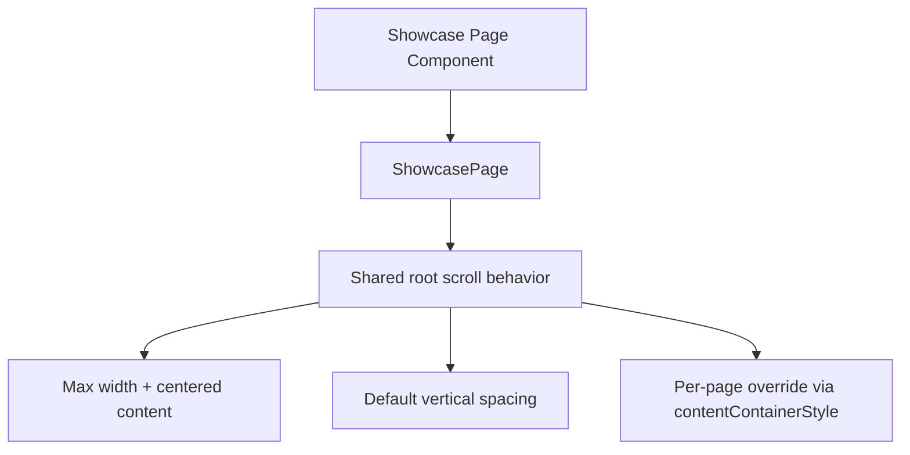

# Showcase Layout Attempt 1

## Goal

Stabilize the in-progress showcase layout refactor and establish one shared page container primitive.

## What Was Unified

- Added `ShowcasePage` as a shared scrollable page container for showcase pages.
- Migrated a large set of showcase pages to use `ShowcasePage` instead of each page repeating root `ScrollView` width/centering/padding setup.
- Fixed type regressions introduced during migration (`ScrollView` imports that were still required for nested horizontal lists).
- Restored a green workspace: lint, typecheck, tests, and build all pass.

## Next Step

Apply the same container abstraction to all remaining showcase pages, then remove direct root `ScrollView` usage from showcase pages entirely.

## Diagram

