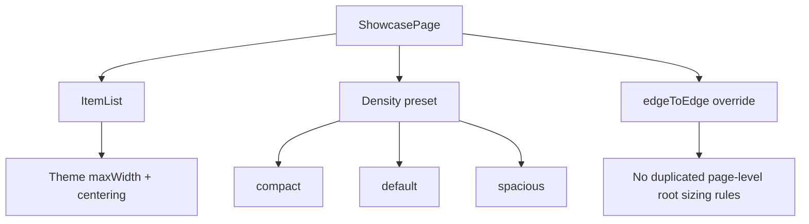

# Showcase Layout Attempt 2

## Goal

Finish root layout unification across every showcase page and move root width/centering ownership to app-level list primitives.

## What Was Unified

- Updated `ShowcasePage` to compose `ItemList` instead of directly using `ScrollView`.
- Added `ShowcasePage` density presets:
  - `compact`
  - `default`
  - `spacious`
- Added `edgeToEdge` support for pages that need full-bleed content.
- Migrated all 50 showcase pages to use `ShowcasePage` as the root container.
- Removed remaining duplicated `maxWidth` + `alignSelf: "center"` root styles from showcase pages.

## Result

- Root layout is now centrally controlled in one place.
- Showcase pages can express layout intent (`density`, `edgeToEdge`) instead of re-implementing container mechanics.
- Nested `ScrollView`s remain only for local, intentional subregions (horizontal filters, detail panes, etc).

## Diagram

