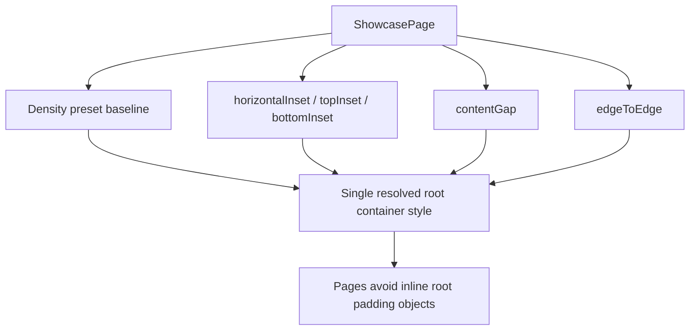

# Showcase Layout Attempt 3

## Goal

Stop page-level root padding object duplication by moving root spacing intent into `ShowcasePage` props.

## What Was Unified

- Extended `ShowcasePage` with spacing props:
  - `horizontalInset`
  - `topInset`
  - `bottomInset`
  - `contentGap`
- Kept `density` as baseline presets and `edgeToEdge` as the full-bleed switch.
- Migrated showcase pages that still passed inline root spacing objects to `ShowcasePage` props.
- Left `contentContainerStyle` only for non-spacing concerns on root (for example page background fills).

## Result

- Root spacing is now authored as layout intent instead of inline padding maps.
- Pages are easier to compose without repeating root container numbers.
- Remaining root style cleanups are now mostly style-object based and can be migrated in the next pass.

## Diagram

